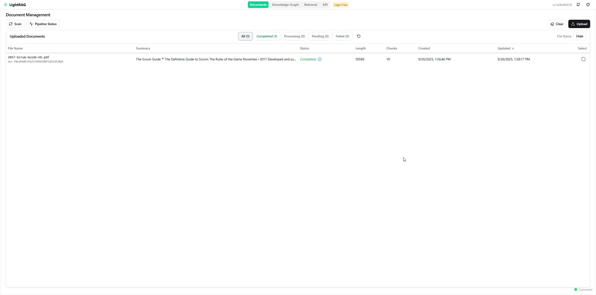
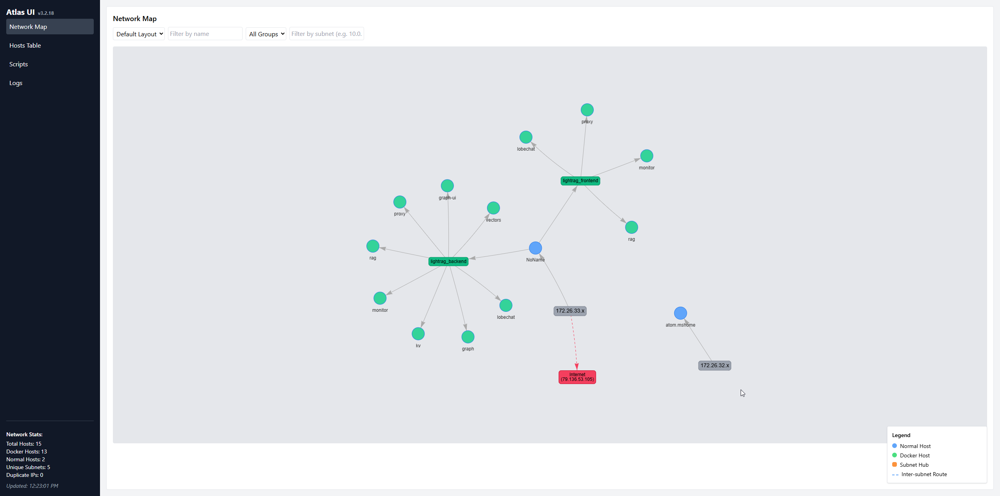
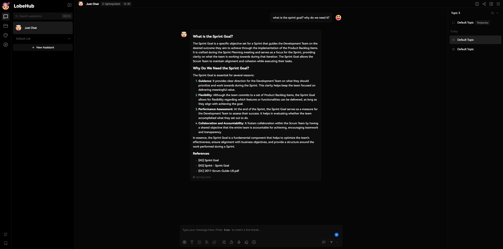
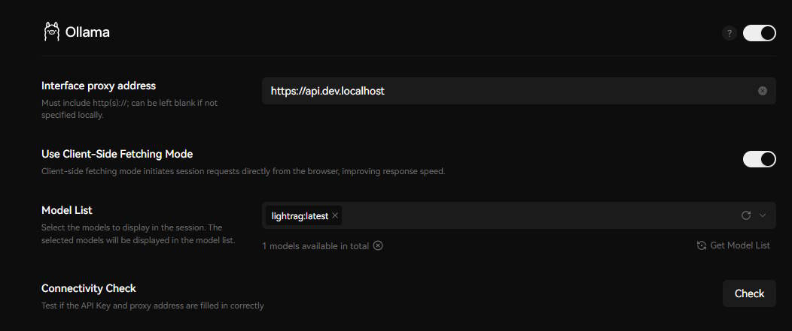
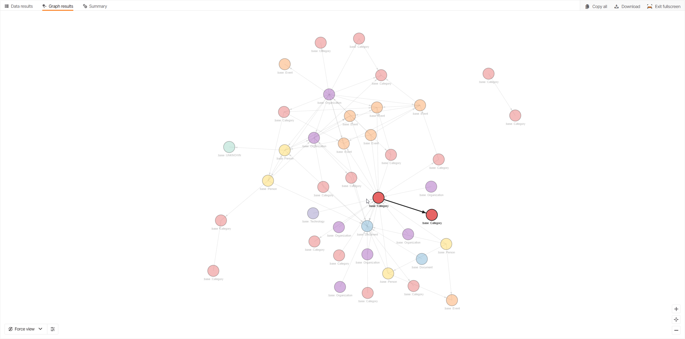
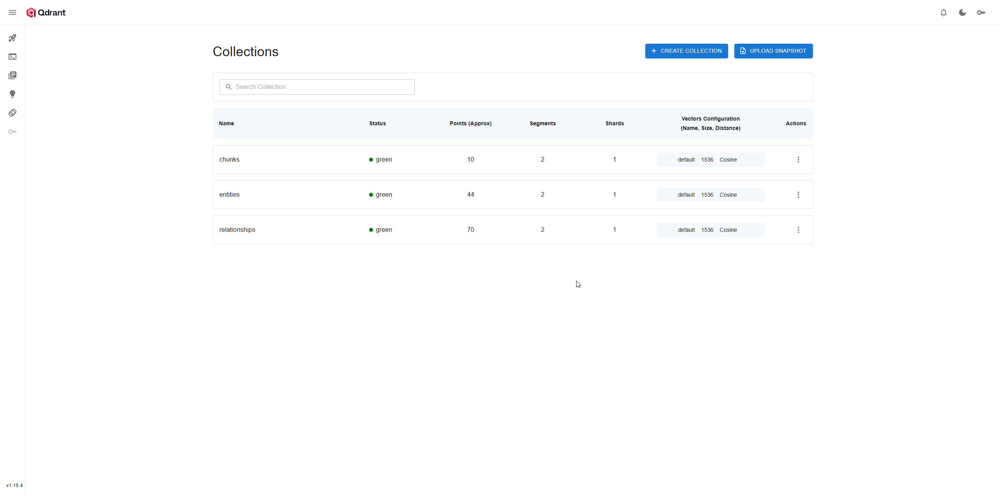
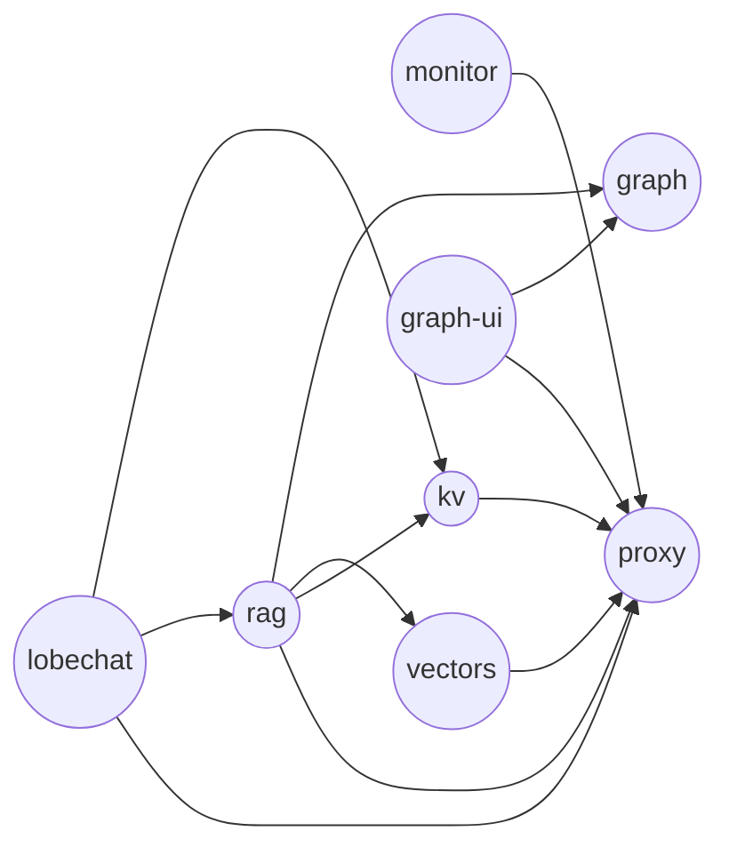

# Light RAG in docker container

[](https://deepwiki.com/OleksandrKucherenko/lightrag)

- [Light RAG in docker container](#light-rag-in-docker-container)
  - [LightRAG Local Development Stack](#lightrag-local-development-stack)
  - [🌐 **Configurable Domain Support**](#-configurable-domain-support)
  - [Developer Environment setup](#developer-environment-setup)
    - [Mise Tool Setup](#mise-tool-setup)
      - [Windows](#windows)
      - [Linux/MacOS/WSL2](#linuxmacoswsl2)
    - [SSL Certificates](#ssl-certificates)
      - [Security Risks](#security-risks)
    - [DNS Setup](#dns-setup)
      - [Windows (Manual Method)](#windows-manual-method)
      - [Configure DNS via hostctl](#configure-dns-via-hostctl)
      - [From WSL2: publish subdomains to Windows hosts via hostctl (auto)](#from-wsl2-publish-subdomains-to-windows-hosts-via-hostctl-auto)
    - [Solution Secrets](#solution-secrets)
  - [Services](#services)
    - [Dependency Graph](#dependency-graph)
    - [Caddy](#caddy)
    - [Lazydocker Web UI](#lazydocker-web-ui)
    - [LobeChat - AI Chat Interface](#lobechat---ai-chat-interface)
  - [⚡ Performance Optimization](#-performance-optimization)
    - [System Requirements](#system-requirements)
    - [Key Performance Settings](#key-performance-settings)
      - [LightRAG Configuration (.env.lightrag)](#lightrag-configuration-envlightrag)
      - [Docker Resource Limits](#docker-resource-limits)
    - [Performance Monitoring](#performance-monitoring)
      - [Key Metrics to Monitor](#key-metrics-to-monitor)
      - [Expected Performance Improvements](#expected-performance-improvements)
    - [Performance Validation](#performance-validation)
      - [Run Performance Benchmarks](#run-performance-benchmarks)
      - [Success Criteria](#success-criteria)
  - [⚙️ Configuration Reference](#️-configuration-reference)
    - [Environment Variables](#environment-variables)
      - [Core Configuration (.env)](#core-configuration-env)
      - [Caddy Configuration (.env.caddy)](#caddy-configuration-envcaddy)
      - [LightRAG Configuration (.env.lightrag)](#lightrag-configuration-envlightrag-1)
      - [LobeChat Configuration (.env.lobechat)](#lobechat-configuration-envlobechat)
    - [Configuration Validation](#configuration-validation)
      - [Quick Validation Commands](#quick-validation-commands)
      - [Test Categories](#test-categories)
  - [📚 Additional Documentation](#-additional-documentation)
    - [Detailed Guides](#detailed-guides)
    - [Deprecated Documentation](#deprecated-documentation)
  - [LLM Helper](#llm-helper)

---

| Web UI Preview (LightRAG)       | Web UI Preview (Atlas)                    | Web UI Preview (LobeChat)                  |
| ------------------------------- | ----------------------------------------- | ------------------------------------------ |
|  |  |  |

| Web UI Preview (Chat Setup)                           | Web UI Preview (MemGraph)       | Web UI Preview (QDrant)       |
| ----------------------------------------------------- | ------------------------------- | ----------------------------- |
|  |  |  |


## LightRAG Local Development Stack

This repository provides a complete Docker Compose setup for running LightRAG with all its dependencies locally.

## 🌐 **Configurable Domain Support**

The stack now supports configurable domains via the `PUBLISH_DOMAIN` environment variable. By default, all services use `dev.localhost`, but you can customize this for different environments:

```bash
# Default configuration (in .env)
PUBLISH_DOMAIN=dev.localhost

# Custom domain examples
PUBLISH_DOMAIN=myapp.local
PUBLISH_DOMAIN=lightrag.internal
PUBLISH_DOMAIN=ai.company.com
```

**Service URLs will automatically adapt:**
- Main: `https://${PUBLISH_DOMAIN}`
- LobeChat: `https://lobechat.${PUBLISH_DOMAIN}`
- LightRAG API: `https://rag.${PUBLISH_DOMAIN}`
- Monitoring: `https://monitor.${PUBLISH_DOMAIN}`
- And all other services...

## Developer Environment setup

Minimalistic Developer environment setup is required to make this solution work. Step:

1. install `mise`
2. configure DNS
3. install self-signed certificates
4. inject OpenAI llm secrets in a secure way

### Mise Tool Setup

#### Windows

```shell
# install scoop 
Set-ExecutionPolicy -ExecutionPolicy RemoteSigned -Scope CurrentUser
Invoke-RestMethod -Uri https://get.scoop.sh | Invoke-Expression

# install mise tool
scoop install mise

# restart powershell terminal to apply all global environment changes (if you run it in VSCODE, you will need to restart the VSCODE process)

cd lightrag # enter project folder 

# MISE should automatically execute setup task if all configured properly
mise trust # may required on first run
```

#### Linux/MacOS/WSL2

```bash
# install BREW tool, ref: https://brew.sh/
/bin/bash -c "$(curl -fsSL https://raw.githubusercontent.com/Homebrew/install/HEAD/install.sh)"

# install mise tool
brew install mise

cd lightrag
mise trust
```

### SSL Certificates

We use self-signed certificates that are created and managed by `mkcert` tool. (MISE tool force it automatic installation)

All certificates are already included into project, but you may want to regenerate them for reducing any security risks.

```bash
cd docker/ssl

# install root certificates
CAROOT=$(pwd) mkcert -install

# re-generate certificate (replace dev.localhost with your PUBLISH_DOMAIN)
CAROOT=$(pwd) mkcert -cert-file ${PUBLISH_DOMAIN}.pem \
  -key-file ${PUBLISH_DOMAIN}-key.pem \
  -p12-file ${PUBLISH_DOMAIN}.p12 \
  ${PUBLISH_DOMAIN} "*.${PUBLISH_DOMAIN}" \
  localhost 127.0.0.1 0.0.0.0 ::1

# For default dev.localhost domain:
CAROOT=$(pwd) mkcert -cert-file dev.localhost.pem \
  -key-file dev.localhost-key.pem \
  -p12-file dev.localhost.p12 \
  dev.localhost "*.dev.localhost" \
  localhost 127.0.0.1 0.0.0.0 ::1

# prepare for Windows HOST machine
openssl x509 -outform der -in rootCA.pem -out rootCA.crt
openssl x509 -inform PEM -in rootCA.pem -outform DER -out rootCA.cer

# Generate windows compatible certificate format, PFX is PKCS12 format
openssl pkcs12 -export -out dev.localhost.pfx -inkey dev.localhost-key.pem -in dev.localhost.pem -certfile rootCA.pem -passout "pass:"
```

In Powershell Admin:

```powershell
cd docker\ssl
# register certificate in 
sudo Import-Certificate -FilePath rootCA.cer -CertStoreLocation Cert:\LocalMachine\Root
```

After installation use `chrome://restart` to force Chrome to reload CA certificates.

#### Security Risks

After sharing the rootCA in project don't forget to reset own root certificate for `mkcert` tool:

```bash
# On macOS/Linux
rm -rf "$(mkcert -CAROOT)"

# On Windows (PowerShell)
Remove-Item -Recurse -Force "$(mkcert -CAROOT)"

# one line that doing all
mkcert -uninstall && rm -rf "$(mkcert -CAROOT)" && mkcert -install
```

### DNS Setup

Recommended tool: https://guumaster.github.io/hostctl/docs/getting-started/ (should be installed automatically by MISE)

```shell
# Windows
scoop install main/hostctl
scoop install main/gsudo # SUDO tool required for elevating the access

# Linux, macos
brew install guumaster/tap/hostctl
```

**🎯 Smart DNS Configuration with PUBLISH_DOMAIN Support:**

```bash
# Linux/macOS: Update local hosts file
mise run hosts-update

# WSL2: Update Windows hosts file from WSL2
mise run hosts-update-windows

# Show current hostctl profile status
mise run hosts-show

# Remove lightrag profile from hosts file
mise run hosts-remove
```

**Multi-platform workflow:** `get-host-ip.sh` → `.etchosts` template → `envsubst` → temporary file → `hostctl replace`

**Supported environments:**
- **Linux**: Uses `127.0.0.1` 
- **macOS**: Uses `127.0.0.1`
- **WSL2**: Auto-detects Windows host IP (PowerShell → Docker → ip route → fallback)

**Helper scripts:**
```bash
# Test HOST_IP detection for your environment
tests/test-host-ip.sh

# Get HOST_IP directly
scripts/get-host-ip.sh
# Returns: 127.0.0.1 (Linux/macOS) or 192.168.x.x (WSL2)
```

**Examples:**

Linux/macOS:
```bash
❯ mise run hosts-update
🌐 All services now accessible at *.dev.localhost
```

WSL2 → Windows:
```bash
❯ mise run hosts-update-windows
🌐 All services now accessible at *.dev.localhost from Windows
```

#### Windows (Manual Method)

**Note:** The `mise run hosts-update` task above works in WSL2 and will automatically detect the correct Windows host IP.

For manual configuration, edit: `C:\Windows\System32\drivers\etc\hosts` 

```txt
# Added by Docker Desktop
192.168.1.103 host.docker.internal
192.168.1.103 gateway.docker.internal

# LightRAG Services (replace with your PUBLISH_DOMAIN)
192.168.1.103 ${PUBLISH_DOMAIN}
192.168.1.103 monitor.${PUBLISH_DOMAIN}
192.168.1.103 kv.${PUBLISH_DOMAIN}
192.168.1.103 graph.${PUBLISH_DOMAIN}
192.168.1.103 rag.${PUBLISH_DOMAIN}
192.168.1.103 vector.${PUBLISH_DOMAIN}
192.168.1.103 lobechat.${PUBLISH_DOMAIN}

# Example with dev.localhost:
# 192.168.1.103 dev.localhost
# 192.168.1.103 monitor.dev.localhost
# etc...
```

```bash
# find the docker host IP
docker run --rm alpine sh -c "ip route | awk '/default/ { print \$3 }'"
```

#### Configure DNS via hostctl

```shell
# Concept: create configuration/profile 'lightrag' from provided file
sudo hostctl replace lightrag --from .etchosts # WARNING! It will not work!

# WARNING. Use mise tasks istead. .etchosts is a template file that cannot
#   be processed by hostctl tool directly. Required resolution of env variables
#   for template file.

# disable configuration/profile
sudo hostctl disable lightrag

# enable configuration
sudo hostctl enable lightrag
```

Inside `C:/Windows/System32/Drivers/etc/hosts` file you can find:

```txt
##################################################################
# Content under this line is handled by hostctl. DO NOT EDIT.
##################################################################

# profile.on lightrag
127.0.0.1 dev.localhost
127.0.0.1 monitor.dev.localhost
127.0.0.1 kv.dev.localhost
127.0.0.1 graph.dev.localhost
127.0.0.1 rag.dev.localhost
# end
```

#### From WSL2: publish subdomains to Windows hosts via hostctl (auto)

Use this when running inside WSL2 to automatically detect your Windows LAN IP from the diagnostics report, transform `.etchosts` to use that IP (instead of `127.0.0.1`), and publish it to the Windows `hosts` file using `hostctl` with elevation via `sudo`.

Prerequisites (in Windows PowerShell):

```shell
# install required tools on windows
scoop install main/hostctl
scoop install main/gsudo
```

Run in WSL2 at the project root:

```bash
# 1) Prepare a temp file visible to Windows with the IP substituted
mkdir -p /mnt/c/Temp
WSL_TMP="/mnt/c/Temp/.etchosts.lightrag.windows"
WIN_TMP="C:\\Temp\\.etchosts.lightrag.windows"

# 2) Resolve variables and prepare temp file
export HOST_IP=$(scripts/get-host-ip.sh)
export PUBLISH_DOMAIN=${PUBLISH_DOMAIN:-dev.localhost}
envsubst < .etchosts > "$WSL_TMP"

# 3) Publish to Windows hosts with elevation (UAC prompt may appear once)
powershell.exe -NoProfile -Command "sudo hostctl replace lightrag --from \"$WIN_TMP\""

# Disable hosts publishing
powershell.exe -NoProfile -Command "sudo hostctl disable lightrag"

# Enable hosts publishing
powershell.exe -NoProfile -Command "sudo hostctl enable lightrag"

# Remove hosts publishing
powershell.exe -NoProfile -Command "sudo hostctl remove lightrag"
```

Notes:
- The IP is taken from the diagnostics section where entries are annotated as `Windows LAN IP (Wi‑Fi/Ethernet)`.
- If `WIN_LAN_IP` ends up empty, ensure `powershell.exe` is available from WSL and that the diagnostics show a `Windows LAN IP` entry.
- `sudo` will request elevation the first time; keep the window focused to accept the UAC prompt.

### Solution Secrets

We use MISE tool secrets support: https://mise.jdx.dev/environments/secrets.html

You will need OpenAI api key with enabled access to embedding and chat models. Open https://platform.openai.com/api-keys and create a new API key.

In addition to that we will need a real email address for the administrator account.

```shell
# install globally tools required for encryption/decryption
mise use -g sops
mise use -g age

# generate unique key for the project (it is your personal key, DO NOT SHARE IT !!!)
age-keygen -o .secrets/mise-age.txt
# Expected output:
#  Public key: <public key>

# make a copy, so mise can find it automatically (or better setup SOPS_AGE_KEY_FILE variable)
cp .secrets/mise-age.txt %HOME%/.config/mise/age.txt

# You can use .env.secrets.example.json for composing own secrets storage and then simply encrypt it

# Encrypt JSON file (`-i` means in-place, so file will be replaced by encrypted version)
sops encrypt -i --age "<public key>" .env.secrets.json

```

You can later decrypt the file with `sops decrypt -i .env.json` or edit it in EDITOR with `sops edit .env.json`. 
However, you'll first need to set `SOPS_AGE_KEY_FILE` to `~/.config/mise/age.txt` to decrypt the file.
This is already done by MISE tool for you.

## Services

### Dependency Graph

The following diagram visualizes service startup dependencies defined in `docker-compose.yaml`.



### Caddy

Caddy server provides reverse proxy, HTTPS termination, and automatic routing for all services.

```bash
# Validate configuration
docker run --rm \
    -v "$(pwd)/docker/etc/caddy/Caddyfile:/etc/caddy/Caddyfile:ro" \
    lucaslorentz/caddy-docker-proxy:latest \
    validate \
    --config /etc/caddy/Caddyfile

# Examine logs
docker compose logs proxy

# Test URL
curl -s http://dev.localhost/debug
curl -s http://dev.localhost/health
curl -s http://dev.localhost/
```

### Lazydocker Web UI

```bash
# encode password `admin`
docker run --rm caddy:2-alpine caddy hash-password --plaintext admin

# Test Url
curl -v http://monitor.dev.localhost --user admin:admin
```

### LobeChat - AI Chat Interface

LobeChat provides a modern TypeScript-based web interface for interacting with the LightRAG system.

**Access URL**: https://lobechat.dev.localhost

**Features**:
- Modern chat interface with LightRAG integration
- Support for multiple query modes: `/global`, `/local`, `/hybrid`
- Redis-backed session storage
- OpenAI-compatible API proxy through LightRAG

**Testing Commands**:
```bash
# Test LobeChat web interface
curl -I https://lobechat.dev.localhost

# Test internal connectivity (from container)
docker compose exec lobechat wget -qO- http://rag:9621/health

# Check LobeChat logs
docker compose logs lobechat

# Test Redis connectivity
docker compose exec kv redis-cli -a "${REDIS_PASSWORD}" ping
```

**Query Modes**:
- **Default/Hybrid**: `What is this about?` - Uses hybrid search approach
- **Global Search**: `/global Key insights?` - Searches across entire knowledge graph
- **Local Search**: `/local Specific details?` - Focused local search
- **Mixed Approach**: `/mix Comprehensive analysis?` - Combines multiple approaches

**Configuration**:
- Database: Redis DB 2 (sessions) and DB 3 (cache)
- LightRAG Proxy: `http://rag:9621/v1` (OpenAI-compatible)
- Access Code: Set via `LOBECHAT_ACCESS_CODE` environment variable (optional)

**Troubleshooting**:
```bash
# Check service status
docker compose ps lobechat

# Verify environment configuration
docker compose exec lobechat env | grep -E "(DATABASE_URL|REDIS_URL|OLLAMA_PROXY_URL)"

# Test LightRAG connectivity
docker compose exec lobechat sh -c "wget -qO- http://rag:9621/health | jq '.status'"
```

## ⚡ Performance Optimization

### System Requirements
- **Memory**: 24GB RAM minimum (with OS overhead)
- **CPU**: 12 cores minimum (16 cores recommended)
- **Storage**: NVMe SSD for optimal performance
- **Network**: Low latency connection for API calls

### Key Performance Settings

#### LightRAG Configuration (.env.lightrag)
```bash
# Concurrency Optimization
MAX_PARALLEL_INSERT=4        # Document-level parallelism (4x improvement)
MAX_ASYNC=8                  # Chunk-level parallelism (2x improvement)
WORKERS=6                    # Controlled worker count

# API Optimization
LLM_API_TIMEOUT=120
LLM_API_RETRY_ATTEMPTS=3
LLM_CONNECTION_POOL_SIZE=20
EMBEDDING_BATCH_SIZE=100
```

#### Docker Resource Limits

```yaml
x-deploy-small: &deploy-small
  resources:
    limits:
      memory: 1G
      cpus: '0.5'
    reservations:
      memory: 512M
      cpus: '0.25'

x-deploy-medium: &deploy-medium
  resources:
    limits:
      memory: 4G
      cpus: '2.0'
    reservations:
      memory: 2G
      cpus: '1.0'

x-deploy-large: &deploy-large
  resources:
    limits:
      memory: 8G
      cpus: '4.0'
    reservations:
      memory: 4G
      cpus: '2.0'
```

### Performance Monitoring

#### Key Metrics to Monitor
```bash
# Monitor container resources (stream)
docker stats

# Check processing logs
docker logs rag -f --tail 100

# Monitor API performance
docker exec rag curl -s http://localhost:9621/metrics

# Storage backend health
docker exec kv redis-cli --latency-history
docker exec vectors curl -s http://localhost:6333/metrics
```

#### Expected Performance Improvements
- **Medium documents (1-10MB)**: 60-70% faster processing
- **Concurrent operations**: 4x increase (8 → 32 operations)
- **Document parallelism**: 2x increase (2 → 4 documents)
- **System stability**: Better resource management

### Performance Validation

#### Run Performance Benchmarks
```bash
# Create benchmark document set
mkdir -p ./benchmark-docs
# Add 10 representative medium documents (1-10MB each)

# Run baseline test
tests/test.suite.sh performance

# Monitor improvements
docker exec rag cat /proc/meminfo | grep -E "(MemTotal|MemAvailable)"
```

#### Success Criteria
- **Processing Time**: 60-70% reduction in document ingestion
- **Resource Usage**: Memory usage within 6GB allocated limit
- **Error Rate**: <5% with enhanced concurrency
- **API Response**: <2 seconds for LLM calls

## ⚙️ Configuration Reference

### Environment Variables

#### Core Configuration (.env)
```bash
# Domain Configuration
PUBLISH_DOMAIN=dev.localhost          # Base domain for all services

# Security
COMPOSE_PROJECT_NAME=lightrag         # Docker Compose project name
```

#### Caddy Configuration (.env.caddy)

```bash
# Caddy Proxy Settings
CADDY_DOCKER_NETWORK=lightrag_frontend
```

#### LightRAG Configuration (.env.lightrag)

```bash
# Server Configuration
HOST=0.0.0.0
PORT=9621
WORKERS=6

# Storage Configuration
LIGHTRAG_KV_STORAGE=RedisKVStorage
LIGHTRAG_VECTOR_STORAGE=QdrantVectorDBStorage
LIGHTRAG_GRAPH_STORAGE=MemgraphStorage

# Storage Connections
REDIS_HOST=kv
REDIS_PORT=6379
QDRANT_URL=http://vectors:6333
MEMGRAPH_URI=bolt://graph:7687

# LLM Configuration
LLM_BINDING=openai
LLM_MODEL=gpt-4o-mini
EMBEDDING_BINDING=openai
EMBEDDING_MODEL=text-embedding-3-small
```

#### LobeChat Configuration (.env.lobechat)

```bash
# Core Configuration
DATABASE_URL=redis://kv:6379/2
REDIS_URL=redis://kv:6379/3
OLLAMA_PROXY_URL=http://rag:9621/v1

# Access Control (optional)
LOBECHAT_ACCESS_CODE=dev-access-2024

# App Settings
NEXT_PUBLIC_APP_NAME="LobeChat + LightRAG"
DEFAULT_AGENT_CONFIG={"model":"lightrag","systemRole":"AI assistant with graph knowledge"}
```

### Configuration Validation

The solution includes a comprehensive test framework following TDD principles with GIVEN/WHEN/THEN patterns.

#### Quick Validation Commands
```bash
# Run all configuration checks
./tests/verify.configuration.v3.sh

# Run specific category checks
find tests/checks -name "security-*" -exec {} \;
find tests/checks -name "environment-*" -exec {} \;

# List all available checks
./tests/verify.configuration.v3.sh --list

# Run individual check
./tests/checks/security-redis-auth.sh
```

#### Test Categories
- **Security**: Authentication and authorization validation
- **Storage**: Data structure and storage backend analysis  
- **Communication**: Service connectivity and API endpoint testing
- **Environment**: System configuration and domain setup
- **Monitoring**: Health checks and service monitoring
- **WSL2**: Windows integration testing (PowerShell/CMD/Bash)

For detailed testing documentation, see [tests/README.md](tests/README.md).

## 📚 Additional Documentation

### Detailed Guides
- **[Testing Framework Guide](tests/README.md)**: Comprehensive testing documentation including GIVEN/WHEN/THEN patterns, test categories, and troubleshooting
- **[Performance Monitoring & Benchmarking](docs/performance-monitoring-benchmark.md)**: Detailed performance measurement procedures, monitoring strategies, and validation methodologies

### Deprecated Documentation
The following documentation files have been moved to `.deprecated/` as their content has been consolidated into this README:

- `caddy-docker-proxy-implementation-plan.md` → Configuration details now in Configuration Reference section
- `lightrag-performance-optimization-guide.md` → Performance settings now in Performance Optimization section
- `lightrag-performance-optimization-summary.md` → Performance overview now in Performance Optimization section
- `custom-domain-name.md` → Domain configuration now in Configuration Reference section

> **Note**: Deprecated documentation is preserved for reference but may contain outdated information. Always refer to this README for the latest configuration and setup instructions.

## LLM Helper

```bash
# ref: https://github.com/github/spec-kit
uvx --from git+https://github.com/github/spec-kit.git specify init --here
```

```bash
╭──────────────────────────────────────────────────────────────── Agent Folder Security ─────────────────────────────────────────────────────────────────╮
│                                                                                                                                                        │
│  Some agents may store credentials, auth tokens, or other identifying and private artifacts in the agent folder within your project.                   │
│  Consider adding .opencode/ (or parts of it) to .gitignore to prevent accidental credential leakage.                                                   │
│                                                                                                                                                        │
╰────────────────────────────────────────────────────────────────────────────────────────────────────────────────────────────────────────────────────────╯

╭──────────────────────────────────────────────────────────────── Agent Folder Security ─────────────────────────────────────────────────────────────────╮
│                                                                                                                                                        │
│  Some agents may store credentials, auth tokens, or other identifying and private artifacts in the agent folder within your project.                   │
│  Consider adding .kilocode/ (or parts of it) to .gitignore to prevent accidental credential leakage.                                                   │
│                                                                                                                                                        │
╰────────────────────────────────────────────────────────────────────────────────────────────────────────────────────────────────────────────────────────╯

```

```bash
╭────────────────────────────────────────────────────────────────────── Next Steps ──────────────────────────────────────────────────────────────────────╮
│                                                                                                                                                        │
│  1. You're already in the project directory!                                                                                                           │
│  2. Start using slash commands with your AI agent:                                                                                                     │
│     2.1 /constitution - Establish project principles                                                                                                   │
│     2.2 /specify - Create baseline specification                                                                                                       │
│     2.3 /plan - Create implementation plan                                                                                                             │
│     2.4 /tasks - Generate actionable tasks                                                                                                             │
│     2.5 /implement - Execute implementation                                                                                                            │
│                                                                                                                                                        │
╰────────────────────────────────────────────────────────────────────────────────────────────────────────────────────────────────────────────────────────╯

╭───────────────────────────────────────────────────────────────── Enhancement Commands ─────────────────────────────────────────────────────────────────╮
│                                                                                                                                                        │
│  Optional commands that you can use for your specs (improve quality & confidence)                                                                      │
│                                                                                                                                                        │
│  ○ /clarify (optional) - Ask structured questions to de-risk ambiguous areas before planning (run before /plan if used)                                │
│  ○ /analyze (optional) - Cross-artifact consistency & alignment report (after /tasks, before /implement)                                               │
│                                                                                                                                                        │
╰────────────────────────────────────────────────────────────────────────────────────────────────────────────────────────────────────────────────────────╯
```