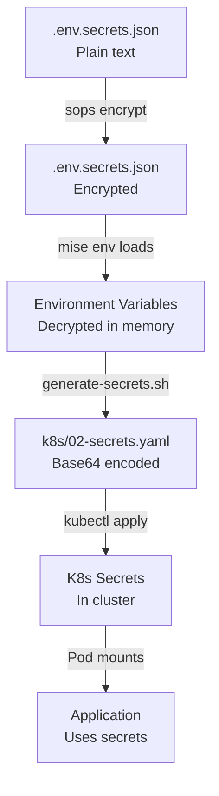

# MISE Integration for Kubernetes Deployment

This document describes how to use MISE for managing K8s tools and secrets in the LightRAG project.

## Overview

MISE provides:
- **Tool Management**: Automatic installation of kubectl, kind, and related tools
- **Secrets Management**: Encrypted storage using SOPS + Age
- **Task Automation**: Simplified K8s workflow with `mise run` commands

## Prerequisites

### 1. Install MISE

**Windows (PowerShell):**
```powershell
scoop install mise
```

**Linux/MacOS/WSL2:**
```bash
brew install mise
```

### 2. Setup Secrets Encryption

```bash
# Navigate to project
cd /mnt/wsl/workspace/rag

# Install global tools for encryption
mise use -g sops
mise use -g age

# Generate encryption key (YOUR PERSONAL KEY - DO NOT SHARE!)
age-keygen -o .secrets/mise-age.txt

# Copy to mise config location
mkdir -p ~/.config/mise
cp .secrets/mise-age.txt ~/.config/mise/age.txt

# Create secrets file from example
cp .env.secrets.example.json .env.secrets.json

# Edit with your actual secrets
nano .env.secrets.json
```

**Example `.env.secrets.json`:**
```json
{
  "LLM_BINDING_API_KEY": "sk-proj-...",
  "EMBEDDING_BINDING_API_KEY": "sk-proj-...",
  "DEFAULT_ADMIN_EMAIL": "admin@example.com"
}
```

### 3. Encrypt Secrets

```bash
# Get your public key
PUBLIC_KEY=$(grep 'public key:' .secrets/mise-age.txt | cut -d: -f2 | xargs)

# Encrypt secrets file
sops encrypt -i --age "$PUBLIC_KEY" .env.secrets.json

# Verify encryption (file should now be encrypted)
cat .env.secrets.json
```

### 4. Trust MISE Configuration

```bash
cd /mnt/wsl/workspace/rag
mise trust
```

## Available MISE Tasks

### K8s Cluster Management

```bash
# Create KIND cluster
mise run k8s-cluster-create

# Delete KIND cluster
mise run k8s-cluster-delete

# Check if tools are installed
mise run k8s-check-tools
```

### Secrets Management

```bash
# Generate K8s secrets from mise environment
mise run k8s-secrets-generate

# This will:
# - Read secrets from .env, .env.secrets.json (decrypted by SOPS)
# - Base64 encode them
# - Generate k8s/02-secrets.yaml
# - Add "managed-by: mise" label for tracking
```

### Deployment

```bash
# Full deployment (includes secrets generation)
mise run k8s-deploy

# Verify deployment health
mise run k8s-verify

# Show deployment status
mise run k8s-status

# View pod logs
mise run k8s-logs -- <pod-name>

# Port forward services to localhost
mise run k8s-port-forward

# Delete deployment
mise run k8s-delete
```

## Complete Workflow

### Initial Setup

```bash
# 1. Setup mise and tools
cd /mnt/wsl/workspace/rag
mise trust
mise install  # Installs kubectl, kind, etc.

# 2. Setup secrets (one-time)
age-keygen -o .secrets/mise-age.txt
cp .secrets/mise-age.txt ~/.config/mise/age.txt
cp .env.secrets.example.json .env.secrets.json
nano .env.secrets.json  # Add your API keys
sops encrypt -i --age "$(grep 'public key:' .secrets/mise-age.txt | cut -d: -f2 | xargs)" .env.secrets.json

# 3. Create cluster
mise run k8s-cluster-create
```

### Deploy Application

```bash
# Single command deployment
mise run k8s-deploy

# This will:
# 1. Check tools are installed
# 2. Generate secrets from mise environment
# 3. Deploy all K8s resources
# 4. Wait for pods to be ready
```

### Access Services

```bash
# Start port forwarding
mise run k8s-port-forward

# In another terminal or browser:
# - LobeChat: http://localhost:3210
# - LightRAG API: http://localhost:9621
# - Memgraph Lab: http://localhost:3000
```

### Verify Everything Works

```bash
# Run comprehensive checks
mise run k8s-verify

# Expected output:
# ✓ kubectl is installed
# ✓ Connected to cluster
# ✓ Namespace exists
# ✓ ConfigMaps exist
# ✓ Secrets exist
# ✓ PVCs are Bound
# ✓ Pods are Running and Ready
# ✓ Services have ClusterIPs
# ✓ No containers using :latest tags
# ✓ Database connectivity confirmed
```

## How Secrets Flow



## Environment Variable Sources

MISE loads variables from multiple sources (in order):

1. **`.env`** - Non-sensitive configuration (PUBLISH_DOMAIN, etc.)
2. **`.env.secrets.json`** - Encrypted secrets (API keys) - decrypted by SOPS
3. **`.env.lightrag`** - LightRAG-specific settings
4. **`.env.databases`** - Database connection details
5. **`.env.lobechat`** - LobeChat configuration

Example combined environment:
```bash
# From .env
PUBLISH_DOMAIN=dev.localhost
REDIS_PASSWORD=p1lCRuXdk9HAMGtOzhKpTe8YuOEvMZ6E5LqsfR3B8h4=

# From .env.secrets.json (decrypted by SOPS)
LLM_BINDING_API_KEY=sk-proj-...
EMBEDDING_BINDING_API_KEY=sk-proj-...

# From .env.lightrag
LLM_BINDING=openai
LLM_MODEL=gpt-4o-mini
```

## Secrets File Format

### Input: `.env.secrets.json` (encrypted)
```json
{
  "LLM_BINDING_API_KEY": "sk-proj-...",
  "EMBEDDING_BINDING_API_KEY": "sk-proj-...",
  "DEFAULT_ADMIN_EMAIL": "admin@example.com"
}
```

### Output: `k8s/02-secrets.yaml` (generated)
```yaml
---
# Auto-generated by generate-secrets.sh from mise environment
apiVersion: v1
kind: Secret
metadata:
  name: lightrag-secrets
  namespace: lightrag
  labels:
    app.kubernetes.io/managed-by: mise
type: Opaque
data:
  REDIS_PASSWORD: cDF...D0=
  LLM_BINDING_API_KEY: c2s...0E=
  EMBEDDING_BINDING_API_KEY: c2s...0E=
  OPENAI_API_KEY: c2s...0E=
  # ... more secrets
```

## Troubleshooting

### Secrets Not Loading

```bash
# Check mise environment
mise env

# Verify SOPS can decrypt
sops decrypt .env.secrets.json

# Verify age key is set
echo $SOPS_AGE_KEY_FILE
# Should show: /home/user/.config/mise/age.txt or similar
```

### Missing API Keys

```bash
# Check what secrets are available
mise exec -- env | grep -E '(LLM_|EMBEDDING_|REDIS_)'

# Regenerate secrets
mise run k8s-secrets-generate

# Verify generated file
cat k8s/02-secrets.yaml | grep "managed-by: mise"
```

### Tools Not Found

```bash
# Reinstall tools
mise install

# Check tool versions
mise run k8s-check-tools

# Manual installation if mise fails
curl -LO "https://dl.k8s.io/release/$(curl -L -s https://dl.k8s.io/release/stable.txt)/bin/linux/amd64/kubectl"
sudo install kubectl /usr/local/bin/kubectl
```

### Cluster Connection Issues

```bash
# Verify cluster exists
kind get clusters

# Check kubectl context
kubectl config current-context
# Should be: kind-lightrag

# Recreate cluster
mise run k8s-cluster-delete
mise run k8s-cluster-create
```

## Security Best Practices

### DO ✅

- **Keep age key private**: Never commit `.secrets/mise-age.txt`
- **Encrypt secrets**: Always use `sops encrypt` before committing
- **Rotate keys**: Change API keys regularly
- **Use strong passwords**: Generate secure random passwords
- **Verify encryption**: Check files are encrypted before pushing

### DON'T ❌

- **Share age keys**: Each developer should have their own
- **Commit plaintext secrets**: Always encrypt with SOPS
- **Use default passwords**: Change all default values
- **Reuse production keys**: Use separate keys for dev/staging/prod
- **Skip verification**: Always run `mise run k8s-verify`

## Advanced Usage

### Multiple Environments

```bash
# Development
cp .env.secrets.json .env.secrets.dev.json
sops encrypt -i --age "$PUBLIC_KEY" .env.secrets.dev.json

# Staging
cp .env.secrets.json .env.secrets.staging.json
sops encrypt -i --age "$PUBLIC_KEY" .env.secrets.staging.json

# Use specific environment
env SOPS_SECRETS_FILE=.env.secrets.staging.json mise run k8s-deploy
```

### Custom MISE Tasks

Add to `mise.toml`:

```toml
[tasks.k8s-backup]
description = "Backup K8s data"
run = '''
kubectl exec -n lightrag deployment/lightrag -- tar czf /tmp/backup.tar.gz /app/data
kubectl cp lightrag/$(kubectl get pod -n lightrag -l app.kubernetes.io/name=lightrag -o name | cut -d/ -f2):/tmp/backup.tar.gz ./backup.tar.gz
'''

[tasks.k8s-restore]
description = "Restore K8s data"
run = '''
kubectl cp ./backup.tar.gz lightrag/$(kubectl get pod -n lightrag -l app.kubernetes.io/name=lightrag -o name | cut -d/ -f2):/tmp/backup.tar.gz
kubectl exec -n lightrag deployment/lightrag -- tar xzf /tmp/backup.tar.gz -C /
'''
```

## Integration with CI/CD

### GitHub Actions Example

```yaml
name: Deploy to K8s

on:
  push:
    branches: [ main ]

jobs:
  deploy:
    runs-on: ubuntu-latest
    steps:
      - uses: actions/checkout@v3
      
      - name: Install mise
        run: |
          curl https://mise.run | sh
          echo "$HOME/.local/bin" >> $GITHUB_PATH
      
      - name: Setup secrets
        env:
          SOPS_AGE_KEY: ${{ secrets.SOPS_AGE_KEY }}
        run: |
          mkdir -p ~/.config/mise
          echo "$SOPS_AGE_KEY" > ~/.config/mise/age.txt
      
      - name: Deploy
        run: |
          mise trust
          mise install
          mise run k8s-cluster-create
          mise run k8s-deploy
          mise run k8s-verify
```

## Comparison: Manual vs MISE

| Task           | Manual Approach            | MISE Approach                   |
| -------------- | -------------------------- | ------------------------------- |
| Install tools  | Multiple commands per tool | `mise install` (auto)           |
| Manage secrets | Manual base64 encoding     | `mise run k8s-secrets-generate` |
| Deploy         | Multiple kubectl commands  | `mise run k8s-deploy`           |
| Verify         | Manual pod checks          | `mise run k8s-verify`           |
| Port forward   | Remember port numbers      | `mise run k8s-port-forward`     |
| Environment    | Export variables manually  | Auto-loaded from files          |

## References

- **MISE Documentation**: https://mise.jdx.dev/
- **SOPS Documentation**: https://github.com/getsops/sops
- **Age Encryption**: https://github.com/FiloSottile/age
- **KIND Documentation**: https://kind.sigs.k8s.io/
- **kubectl Reference**: https://kubernetes.io/docs/reference/kubectl/

## Support

For issues with:
- **MISE tasks**: Check `mise.toml` configuration
- **Secrets**: Verify `.env.secrets.json` and age key
- **K8s deployment**: Run `mise run k8s-verify`
- **Tools**: Run `mise doctor`
