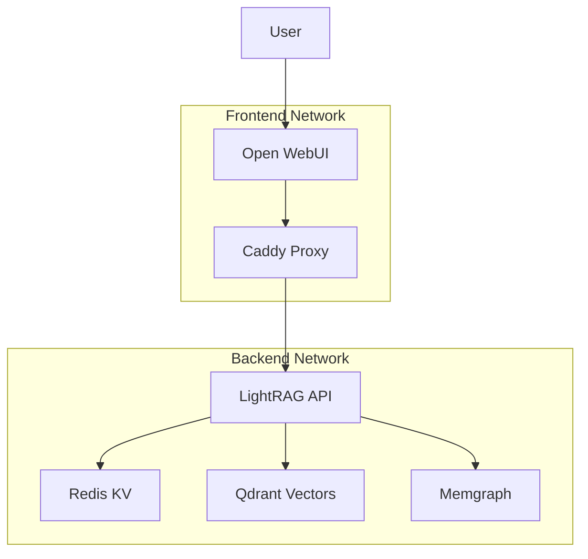

# Open WebUI Integration Plan

## Overview

This document outlines the integration of Open WebUI as a frontend interface for the existing LightRAG stack. The integration will provide a user-friendly web interface that connects to the LightRAG API backend.

## Architecture



## Integration Components

### 1. Open WebUI Service Definition

The Open WebUI service will be added to the existing docker-compose.yaml with the following configuration:

```yaml
# Open WebUI Frontend
webui:
  image: ghcr.io/open-webui/open-webui:main
  container_name: webui
  restart: unless-stopped
  depends_on:
    - proxy
    - rag
  env_file:
    - .env
    - .env.openwebui
  volumes:
    - openwebui_data:/app/backend/data
  networks:
    - frontend
    - backend
  ports:
    - 3000:8080
  labels:
    # Caddy labels for automatic subdomain routing
    caddy: "https://webui.dev.localhost"
    caddy.reverse_proxy: "{{upstreams 8080}}"
    caddy.tls: "/certificates/dev.localhost.pem /certificates/dev.localhost-key.pem"
  healthcheck:
    test: ["CMD", "curl", "-f", "http://localhost:8080/health"]
    interval: 30s
    timeout: 10s
    retries: 3
    start_period: 60s
  deploy:
    resources:
      limits:
        memory: 2G
        cpus: '1.0'
      reservations:
        memory: 1G
        cpus: '0.5'
  logging:
    driver: "json-file"
    options:
      max-size: "10m"
      max-file: "3"
```

### 2. Volume Definition

Add to the volumes section:

```yaml
# OpenWebUI Data
openwebui_data:
  driver: local
  driver_opts:
    type: none
    o: bind
    device: ./docker/data/openwebui
```

### 3. Environment Configuration

#### Main Environment File (.env)
Add these secrets to your existing `.env` file:

```bash
# Open WebUI Secrets (add to existing .env)
WEBUI_SECRET_KEY=your_secure_webui_secret_key_here_32chars
LIGHTRAG_API_KEY=your_secure_lightrag_api_key_here_32chars
```

#### Open WebUI Configuration (.env.openwebui)
Create a new environment file for Open WebUI specific settings:

```bash
# =============================================================================
# OPENWEBUI CONFIGURATION
# =============================================================================

# Core Configuration
WEBUI_AUTH=True
WEBUI_NAME=LightRAG Production
WEBUI_DESCRIPTION=RAG System with Knowledge Graphs

# API Configuration
OPENAI_API_BASE_URL=http://rag:9621/v1
OPENAI_API_KEY=${LIGHTRAG_API_KEY}

# User Management
JWT_EXPIRES_IN=3600
ENABLE_OAUTH_SIGNUP=false
DEFAULT_USER_ROLE=user
ENABLE_ADMIN_EXPORT=true

# Features
ENABLE_COMMUNITY_SHARING=false
ENABLE_SIGNUP=true
ENABLE_LOGIN_FORM=true

# File Upload
FILE_UPLOAD_ENABLED=true
FILE_UPLOAD_SIZE_LIMIT=200
SUPPORTED_FILE_TYPES=.pdf,.doc,.docx,.txt,.md,.csv,.json

# Chat Configuration
CHAT_COMPLETION_ENABLED=true
CHAT_HISTORY_ENABLED=true
MAX_CHAT_HISTORY=50

# CORS Settings
CORS_ALLOW_ORIGIN=*
```

### 4. DNS Configuration Update

Update the `.etchosts` file to include the new subdomain:

```
127.0.0.1 dev.localhost
127.0.0.1 monitor.dev.localhost
127.0.0.1 kv.dev.localhost
127.0.0.1 graph.dev.localhost
127.0.0.1 rag.dev.localhost
127.0.0.1 webui.dev.localhost
127.0.0.1 vector.dev.localhost
```

## Integration Details

### API Compatibility

- **LightRAG API**: The existing LightRAG service exposes an OpenAI-compatible API at `/v1/` endpoints
- **Open WebUI**: Designed to work with OpenAI-compatible APIs
- **Connection**: Open WebUI will connect to `http://rag:9621/v1` internally within the Docker network

### Security Configuration

- **Authentication**: Open WebUI will handle user authentication
- **API Access**: Internal communication between Open WebUI and LightRAG within Docker network
- **TLS**: Caddy provides SSL termination with existing certificates
- **Network Isolation**: Backend services remain on internal network

### Data Persistence

- **Open WebUI Data**: Stored in `./docker/data/openwebui`
- **LightRAG Data**: Existing storage configuration unchanged
- **User Sessions**: Managed by Open WebUI with JWT tokens

## Implementation Steps

1. **Create Environment File**: Create `.env.openwebui` with required configuration
2. **Update docker-compose.yaml**: Add Open WebUI service definition
3. **Add Volume Configuration**: Include OpenWebUI data volume
4. **Update DNS Configuration**: Add webui.dev.localhost to .etchosts
5. **Create Data Directory**: Ensure `./docker/data/openwebui` exists
6. **Test Integration**: Verify services start and communicate properly

## Access URLs

After implementation, the following URLs will be available:

- **Open WebUI**: https://webui.dev.localhost
  - **Admin Login**: `kucherenko.alex@gmail.com` / `admin`
- **LightRAG API**: https://rag.dev.localhost
- **Monitoring**: https://monitor.dev.localhost
- **Graph UI**: https://graph.dev.localhost
- **Vector DB**: https://vector.dev.localhost

## Admin Account Access

The system includes an admin account with reset password for immediate access:

- **Email**: `kucherenko.alex@gmail.com`
- **Password**: `admin` (reset via database update)
- **Role**: Administrator with full system access (promoted from user role)

**Security Note**: Change the default admin password after first login in a production environment.

## Configuration Validation

### Required Environment Variables

#### In `.env` (secrets):
- `WEBUI_SECRET_KEY`: Secret key for Open WebUI sessions
- `LIGHTRAG_API_KEY`: API key for LightRAG access

#### In `.env.openwebui` (configuration):
- All Open WebUI specific configuration
- API connection settings
- Feature toggles
- UI customization settings

### Health Checks

- Open WebUI health endpoint: `/health`
- LightRAG API health endpoint: `/health`
- Caddy proxy routing validation

## Troubleshooting

### Common Issues

1. **Connection Refused**: Check if LightRAG service is running and healthy
2. **Authentication Errors**: Verify API keys match between services
3. **DNS Resolution**: Ensure .etchosts file is properly configured
4. **SSL Certificates**: Verify certificates are valid for dev.localhost domain

### Debugging Steps

1. Check service logs: `docker compose logs webui`
2. Verify network connectivity: `docker compose exec webui curl http://rag:9621/health`
3. Check Caddy routing: `docker compose logs proxy`

## Migration Notes

- Existing services remain unchanged
- No impact on current LightRAG functionality
- New Open WebUI provides additional frontend option
- All data persistence configurations preserved

## Security Considerations

- Internal API communication within Docker network
- External access only through Caddy proxy with SSL
- User authentication handled by Open WebUI
- File upload restrictions configured
- CORS policies properly set

This integration provides a modern, user-friendly interface while maintaining the robust backend architecture of your LightRAG system.