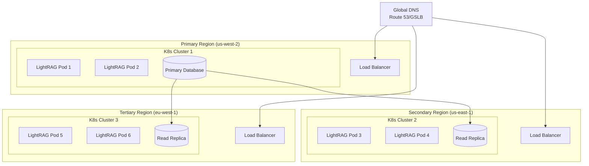

# Kubernetes Cluster Maintenance Guide

This guide covers common maintenance tasks for running LightRAG in production Kubernetes clusters.

## Table of Contents

- [Secret Management and Rotation](#secret-management-and-rotation)
- [Cluster Scaling](#cluster-scaling)
- [Service and Node Management](#service-and-node-management)
- [Backup and Recovery](#backup-and-recovery)
- [Multi-Region Deployment](#multi-region-deployment)
- [Routine Maintenance Tasks](#routine-maintenance-tasks)
- [Emergency Procedures](#emergency-procedures)
- [Monitoring and Alerting](#monitoring-and-alerting)

## Secret Management and Rotation

### Overview

LightRAG uses several types of secrets that require regular rotation:
- API keys (OpenAI, embedding providers)
- Database passwords (Redis)
- Application-specific keys (LightRAG API key, LobeChat access code)

### Manual Secret Rotation

#### 1. Rotate API Keys

```bash
# Create new secrets
kubectl create secret generic lightrag-secrets-new \
  --namespace=lightrag \
  --from-literal=REDIS_PASSWORD='new-redis-password' \
  --from-literal=LLM_BINDING_API_KEY='sk-new-llm-key' \
  --from-literal=EMBEDDING_BINDING_API_KEY='sk-new-embedding-key' \
  --from-literal=OPENAI_API_KEY='sk-new-openai-key' \
  --from-literal=LIGHTRAG_API_KEY='new-lightrag-key' \
  --from-literal=LOBECHAT_ACCESS_CODE='new-access-code'

# Update Redis password separately
kubectl create secret generic redis-secret-new \
  --namespace=lightrag \
  --from-literal=password='new-redis-password'

# Patch deployments to use new secrets
kubectl patch deployment lightrag -n lightrag -p '{"spec":{"template":{"spec":{"containers":[{"name":"lightrag","envFrom":[{"secretRef":{"name":"lightrag-secrets-new"}}]}]}}}}'

kubectl patch deployment lobechat -n lightrag -p '{"spec":{"template":{"spec":{"containers":[{"name":"lobechat","envFrom":[{"secretRef":{"name":"lightrag-secrets-new"}}]}]}}}}'

# Restart StatefulSets
kubectl rollout restart statefulset redis -n lightrag
kubectl rollout restart statefulset memgraph -n lightrag
kubectl rollout restart statefulset qdrant -n lightrag

# Verify rollout
kubectl rollout status deployment/lightrag -n lightrag
kubectl rollout status deployment/lobechat -n lightrag
kubectl rollout status statefulset/redis -n lightrag

# Clean up old secrets
kubectl delete secret lightrag-secrets redis-secret -n lightrag
kubectl patch secret lightrag-secrets-new -n lightrag -p '{"metadata":{"name":"lightrag-secrets"}}'
kubectl patch secret redis-secret-new -n lightrag -p '{"metadata":{"name":"redis-secret"}}'
```

#### 2. Automated Rotation with External Secrets Operator

```yaml
# external-secrets.yaml
apiVersion: external-secrets.io/v1beta1
kind: SecretStore
metadata:
  name: lightrag-secret-store
  namespace: lightrag
spec:
  provider:
    aws:
      service: SecretsManager
      region: us-west-2
---
apiVersion: external-secrets.io/v1beta1
kind: ExternalSecret
metadata:
  name: lightrag-secrets
  namespace: lightrag
spec:
  refreshInterval: 24h
  secretStoreRef:
    name: lightrag-secret-store
    kind: SecretStore
  target:
    name: lightrag-secrets
    creationPolicy: Owner
  dataFrom:
    - extract:
        key: lightrag/production/secrets
```

#### 3. Sealed Secrets for Production

```bash
# Install sealed-secrets controller
helm repo add sealed-secrets https://bitnami-labs.github.io/sealed-secrets
helm install sealed-secrets sealed-secrets/sealed-secrets -n kube-system

# Create sealed secret
kubeseal --format=yaml < 02-secrets.yaml > 02-secrets-sealed.yaml

# Commit sealed secret to git (safe)
git add 02-secrets-sealed.yaml
git commit -m "Add sealed secrets"

# Apply sealed secret
kubectl apply -f 02-secrets-sealed.yaml
```

### Secret Rotation Schedule

| Secret Type | Rotation Frequency | Method |
|-------------|-------------------|--------|
| API Keys | Every 90 days | Manual/Automated |
| Database Passwords | Every 180 days | Manual |
| Application Keys | Every 120 days | Manual |
| TLS Certificates | Auto-renew | cert-manager |

## Cluster Scaling

### Horizontal Scaling

#### 1. Scale Stateful Applications

```bash
# Scale LobeChat for high availability
kubectl scale deployment lobechat --replicas=3 -n lightrag

# Add anti-affinity for pod distribution
kubectl patch deployment lobechat -n lightrag -p '{
  "spec": {
    "template": {
      "spec": {
        "affinity": {
          "podAntiAffinity": {
            "preferredDuringSchedulingIgnoredDuringExecution": [{
              "weight": 100,
              "podAffinityTerm": {
                "labelSelector": {
                  "matchExpressions": [{
                    "key": "app.kubernetes.io/name",
                    "operator": "In",
                    "values": ["lobechat"]
                  }]
                },
                "topologyKey": "kubernetes.io/hostname"
              }
            }]
          }
        }
      }
    }
  }
}'

# Verify scaling
kubectl get pods -n lightrag -l app.kubernetes.io/name=lobechat --show-labels
kubectl get pods -n lightrag -o wide
```

#### 2. Scale LightRAG (Requires Shared Storage)

```bash
# Enable shared storage for LightRAG scaling
kubectl apply -f - <<EOF
apiVersion: v1
kind: PersistentVolumeClaim
metadata:
  name: lightrag-shared-storage
  namespace: lightrag
spec:
  accessModes:
    - ReadWriteMany
  resources:
    requests:
      storage: 50Gi
  storageClassName: nfs-storage
EOF

# Update LightRAG deployment to use shared storage
kubectl patch deployment lightrag -n lightrag -p '{
  "spec": {
    "template": {
      "spec": {
        "volumes": [{
          "name": "shared-storage",
          "persistentVolumeClaim": {
            "claimName": "lightrag-shared-storage"
          }
        }],
        "containers": [{
          "name": "lightrag",
          "volumeMounts": [{
            "name": "shared-storage",
            "mountPath": "/app/shared"
          }]
        }]
      }
    }
  }
}'

# Scale to 2 replicas
kubectl scale deployment lightrag --replicas=2 -n lightrag
```

#### 3. Auto-scaling Configuration

```bash
# Create HPA for LobeChat
kubectl autoscale deployment lobechat \
  --namespace=lightrag \
  --min=1 \
  --max=10 \
  --cpu-percent=70 \
  --memory-percent=80

# Create HPA for LightRAG
kubectl autoscale deployment lightrag \
  --namespace=lightrag \
  --min=1 \
  --max=5 \
  --cpu-percent=60

# Monitor HPA
kubectl get hpa -n lightrag -w
```

### Vertical Scaling

```bash
# Check current resource usage
kubectl top pods -n lightrag
kubectl describe pod <pod-name> -n lightrag

# Increase resources for LightRAG
kubectl patch deployment lightrag -n lightrag -p '{
  "spec": {
    "template": {
      "spec": {
        "containers": [{
          "name": "lightrag",
          "resources": {
            "requests": {
              "memory": "4Gi",
              "cpu": "2000m"
            },
            "limits": {
              "memory": "8Gi",
              "cpu": "4000m"
            }
          }
        }]
      }
    }
  }
}'

# Verify restart
kubectl rollout status deployment/lightrag -n lightrag
```

### Cluster Autoscaling

```yaml
# cluster-autoscaler.yaml
apiVersion: apps/v1
kind: Deployment
metadata:
  name: cluster-autoscaler
  namespace: kube-system
spec:
  replicas: 1
  selector:
    matchLabels:
      app: cluster-autoscaler
  template:
    metadata:
      labels:
        app: cluster-autoscaler
    spec:
      containers:
      - image: k8s.gcr.io/autoscaling/cluster-autoscaler:v1.21.0
        name: cluster-autoscaler
        resources:
          limits:
            cpu: 100m
            memory: 300Mi
          requests:
            cpu: 100m
            memory: 300Mi
        command:
        - ./cluster-autoscaler
        - --v=4
        - --stderrthreshold=info
        - --cloud-provider=aws
        - --skip-nodes-with-local-storage=false
        - --expander=least-waste
        - --node-group-auto-discovery=asg:tag=k8s.io/cluster-autoscaler/enabled,k8s.io/cluster-autoscaler/lightrag
```

## Service and Node Management

### Drain Node for Maintenance

```bash
# List nodes
kubectl get nodes

# Cordon node (no new pods)
kubectl cordon <node-name>

# Drain node (evict existing pods)
kubectl drain <node-name> --ignore-daemonsets --delete-emptydir-data --force

# Perform maintenance (upgrade, patch, etc.)

# Uncordon node
kubectl uncordon <node-name>

# Verify pods are rescheduled
kubectl get pods -n lightrag --show-labels -o wide
```

### Service Restart Strategies

#### 1. Rolling Restart

```bash
# Restart all services with rolling update
kubectl rollout restart deployment/lobechat -n lightrag
kubectl rollout restart deployment/lightrag -n lightrag

# Restart StatefulSets one by one
kubectl rollout restart statefulset/redis -n lightrag
# Wait for ready before next
kubectl wait --for=condition=ready pod -l app.kubernetes.io/name=redis -n lightrag --timeout=300s
kubectl rollout restart statefulset/memgraph -n lightrag
```

#### 2. Blue-Green Deployment

```bash
# Create blue-green deployment
kubectl apply -f - <<EOF
apiVersion: argoproj.io/v1alpha1
kind: Rollout
metadata:
  name: lightrag-bg
  namespace: lightrag
spec:
  replicas: 3
  strategy:
    blueGreen:
      activeService: lightrag-active
      previewService: lightrag-preview
      autoPromotionEnabled: false
      scaleDownDelaySeconds: 30
      prePromotionAnalysis:
        templates:
        - templateName: success-rate
        args:
        - name: service-name
          value: lightrag-preview
      postPromotionAnalysis:
        templates:
        - templateName: success-rate
        args:
        - name: service-name
          value: lightrag-active
  selector:
    matchLabels:
      app: lightrag
  template:
    metadata:
      labels:
        app: lightrag
    spec:
      containers:
      - name: lightrag
        image: ghcr.io/hkuds/lightrag:0.0.5
        ports:
        - containerPort: 9621
EOF
```

### Node Troubleshooting

```bash
# Check node status
kubectl get nodes -o wide
kubectl describe node <node-name>

# Check node conditions
kubectl get nodes -o jsonpath='{.items[*].status.conditions[?(@.type=="Ready")].status}'

# Check resource usage
kubectl top nodes
kubectl describe node <node-name> | grep -A 5 "Allocated resources"

# Check for taints
kubectl describe node <node-name> | grep -A 10 "Taints"

# Remove taint if needed
kubectl taint nodes <node-name> key-
```

## Backup and Recovery

### Data Backup Strategy

#### 1. Persistent Volume Snapshots

```bash
# Create VolumeSnapshotClass
kubectl apply -f - <<EOF
apiVersion: snapshot.storage.k8s.io/v1
kind: VolumeSnapshotClass
metadata:
  name: csi-hostpath-snapclass
driver: hostpath.csi.k8s.io
deletionPolicy: Delete
EOF

# Create scheduled snapshots
kubectl apply -f - <<EOF
apiVersion: snapshot.storage.k8s.io/v1
kind: VolumeSnapshot
metadata:
  name: redis-data-snap
  namespace: lightrag
spec:
  volumeSnapshotClassName: csi-hostpath-snapclass
  source:
    persistentVolumeClaimName: redis-data
---
apiVersion: snapshot.storage.k8s.io/v1
kind: VolumeSnapshot
metadata:
  name: memgraph-data-snap
  namespace: lightrag
spec:
  volumeSnapshotClassName: csi-hostpath-snapclass
  source:
    persistentVolumeClaimName: memgraph-data
---
apiVersion: snapshot.storage.k8s.io/v1
kind: VolumeSnapshot
metadata:
  name: qdrant-storage-snap
  namespace: lightrag
spec:
  volumeSnapshotClassName: csi-hostpath-snapclass
  source:
    persistentVolumeClaimName: qdrant-storage
EOF
```

#### 2. Database-Specific Backups

```bash
# Redis backup
kubectl exec -n lightrag redis-0 -- redis-cli --rdb /data/redis-backup-$(date +%Y%m%d).rdb
kubectl cp lightrag/redis-0:/data/redis-backup-$(date +%Y%m%d).rdb ./redis-backup-$(date +%Y%m%d).rdb

# Memgraph backup
kubectl exec -n lightrag memgraph-0 -- bash -c "echo 'DUMP DATABASE;' | mgconsole > /data/memgraph-backup-$(date +%Y%m%d).dump"
kubectl cp lightrag/memgraph-0:/data/memgraph-backup-$(date +%Y%m%d).dump ./memgraph-backup-$(date +%Y%m%d).dump

# Qdrant backup
kubectl exec -n lightrag qdrant-0 -- curl -X POST 'http://localhost:6333/snapshots' -H 'Content-Type: application/json'
kubectl cp lightrag/qdrant-0:/qdrant/snapshots/snapshot-$(date +%Y%m%d).tar.gz ./qdrant-backup-$(date +%Y%m%d).tar.gz
```

#### 3. Velero Integration

```bash
# Install Velero
helm repo add vmware-tanzu https://vmware-tanzu.github.io/helm-charts
helm install velero vmware-tanzu/velero \
  --namespace velero \
  --create-namespace \
  --set configuration.provider=aws \
  --set configuration.backupStorageLocation.name=default \
  --set configuration.backupStorageLocation.bucket=lightrag-backups \
  --set configuration.backupStorageLocation.config.region=us-west-2 \
  --set credentials.useSecret=false

# Create backup schedule
velero create schedule lightrag-daily \
  --namespace=lightrag \
  --schedule="0 2 * * *" \
  --include-namespaces=lightrag \
  --default-volumes-to-fs-backup \
  --storage-location=default

# Create on-demand backup
velero create backup lightrag-backup-$(date +%Y%m%d-%H%M%S) \
  --namespace=lightrag \
  --include-namespaces=lightrag \
  --default-volumes-to-fs-backup

# List backups
velero get backups

# Restore from backup
velero restore create --from-backup lightrag-backup-20240101-020000
```

### Disaster Recovery Procedures

#### 1. Complete Cluster Recovery

```bash
# 1. Restore from Velero backup
velero restore create --from-backup lightrag-backup-latest

# 2. Verify all resources are restored
kubectl get all -n lightrag

# 3. Check pod status
kubectl get pods -n lightrag

# 4. Verify data integrity
kubectl exec -n lightrag redis-0 -- redis-cli ping
kubectl exec -n lightrag qdrant-0 -- curl http://localhost:6333/health

# 5. Test application functionality
kubectl port-forward -n lightrag svc/lightrag 9621:9621 &
curl http://localhost:9621/health
```

#### 2. Selective Data Recovery

```bash
# Restore only Redis data
kubectl delete pvc redis-data -n lightrag
kubectl apply -f 03-storage.yaml  # Recreate Redis PVC
kubectl exec -n lightrag redis-0 -- redis-cli --rdb /data/restore.rdb < ./redis-backup-latest.rdb
kubectl rollout restart statefulset/redis -n lightrag

# Restore only Qdrant data
kubectl delete pvc qdrant-storage -n lightrag
kubectl apply -f 03-storage.yaml
kubectl cp ./qdrant-backup-latest.tar.gz lightrag/qdrant-0:/qdrant/snapshots/
kubectl exec -n lightrag qdrant-0 -- tar -xzf /qdrant/snapshots/qdrant-backup-latest.tar.gz -C /qdrant/storage/
kubectl rollout restart statefulset/qdrant -n lightrag
```

## Multi-Region Deployment

### Architecture Overview



### Primary Region Setup

```bash
# Deploy primary cluster
kubectl apply -f k8s/

# Configure Redis as master
kubectl exec -n lightrag redis-0 -- redis-cli CONFIG SET replica-announce-ip $(kubectl get svc redis -n lightrag -o jsonpath='{.spec.clusterIP}')

# Enable Redis replication
kubectl patch statefulset redis -n lightrag -p '{
  "spec": {
    "template": {
      "spec": {
        "containers": [{
          "name": "redis",
          "command": ["redis-server"]
        }]
      }
    }
  }
}'
```

### Replica Region Setup

```yaml
# replica-deployment.yaml
apiVersion: v1
kind: Namespace
metadata:
  name: lightrag-replica
---
apiVersion: v1
kind: Secret
metadata:
  name: lightrag-secrets
  namespace: lightrag-replica
type: Opaque
data:
  # Use same secrets as primary
---
apiVersion: apps/v1
kind: StatefulSet
metadata:
  name: redis-replica
  namespace: lightrag-replica
spec:
  replicas: 1
  serviceName: redis-replica
  selector:
    matchLabels:
      app.kubernetes.io/name: redis-replica
  template:
    metadata:
      labels:
        app.kubernetes.io/name: redis-replica
    spec:
      containers:
      - name: redis
        image: redis:8-alpine
        command: ["redis-server", "--replicaof", "redis-primary.lightrag.svc.cluster.local", "6379"]
        env:
        - name: REDIS_PASSWORD
          valueFrom:
            secretKeyRef:
              name: redis-secret
              key: password
---
# Similar configurations for other services as read-only replicas
```

### Global Load Balancing

```yaml
# global-lb.yaml (AWS Route 53)
apiVersion: externaldns.k8s.io/v1alpha1
kind: DNSEndpoint
metadata:
  name: lightrag-global-dns
  namespace: lightrag
spec:
  endpoints:
  - dnsName: api.lightrag.com
    recordTTL: 60
    recordType: A
    setIdentifier: us-west-2
    healthCheck:
      protocol: HTTP
      port: 9621
      path: /health
      failureThreshold: 3
      resourcePath: /health
    targets:
    - 34.212.123.45  # Primary region LB
  - dnsName: api.lightrag.com
    recordTTL: 60
    recordType: A
    setIdentifier: us-east-1
    healthCheck:
      protocol: HTTP
      port: 9621
      path: /health
      failureThreshold: 3
    targets:
    - 3.85.123.67   # Secondary region LB
  - dnsName: api.lightrag.com
    recordTTL: 60
    recordType: A
    setIdentifier: eu-west-1
    healthCheck:
      protocol: HTTP
      port: 9621
      path: /health
      failureThreshold: 3
    targets:
    - 34.244.123.89  # Tertiary region LB
```

### Cross-Region Data Sync

```bash
# Set up Redis replication chain
kubectl exec -n lightrag-replica redis-replica-0 -- redis-cli REPLICAOF redis-primary.lightrag.svc.cluster.local 6379

# Configure Qdrant replication
kubectl apply -f - <<EOF
apiVersion: qdrant.io/v1
kind: QdrantCluster
metadata:
  name: qdrant-replica
  namespace: lightrag-replica
spec:
  replicas: 1
  image: qdrant/qdrant:v1.10.1
  bootstrap:
    expectPeers: 1
    bootstrapTimeout: 30s
  replication:
    factor: 1
EOF

# Set up Memgraph replication
kubectl exec -n lightrag-replica memgraph-0 -- mgconsole --log-level TRACE <<EOF
SET REPLICATION ROLE TO REPLICA WITH REPLICA OF 'redis-primary.lightrag.svc.cluster.local:7687';
EOF
```

## Routine Maintenance Tasks

### Daily Tasks

```bash
#!/bin/bash
# daily-maintenance.sh

echo "=== Daily LightRAG Maintenance $(date) ==="

# 1. Check pod health
echo "Checking pod health..."
kubectl get pods -n lightrag --field-selector=status.phase!=Running

# 2. Check resource usage
echo "Checking resource usage..."
kubectl top pods -n lightrag --sort-by=cpu
kubectl top pods -n lightrag --sort-by=memory

# 3. Check PVC usage
echo "Checking storage usage..."
kubectl get pvc -n lightrag
df -h /var/lib/kubelet/pods

# 4. Verify connectivity
echo "Testing service connectivity..."
kubectl run -it --rm connectivity-test --image=curlimages/curl --restart=Never -n lightrag -- \
  curl -f http://lightrag:9621/health || echo "LightRAG health check failed"

# 5. Check for errors in logs
echo "Checking for errors..."
kubectl logs -n lightrag --tail=100 --all-containers | grep -i error || echo "No errors found"

echo "=== Daily maintenance complete ==="
```

### Weekly Tasks

```bash
#!/bin/bash
# weekly-maintenance.sh

echo "=== Weekly LightRAG Maintenance $(date) ==="

# 1. Security scan
echo "Running security scan..."
kubectl get pods -n lightrag -o json | kubectl rbac-tool audit

# 2. Update check
echo "Checking for updates..."
helm repo update
helm search repo lightrag

# 3. Backup verification
echo "Verifying backups..."
velero get backups --output=json | jq '.items[] | select(.status.phase == "Completed") | .metadata.name'

# 4. Performance metrics
echo "Collecting performance metrics..."
kubectl top nodes
kubectl describe nodes | grep -A 5 "Allocated resources"

# 5. Cleanup old resources
echo "Cleaning up old resources..."
kubectl delete pods -n lightrag --field-selector=status.phase=Succeeded
kubectl delete jobs -n lightrag --field-selector=status.successful=1

echo "=== Weekly maintenance complete ==="
```

### Monthly Tasks

```bash
#!/bin/bash
# monthly-maintenance.sh

echo "=== Monthly LightRAG Maintenance $(date) ==="

# 1. Full backup test
echo "Testing backup restore..."
BACKUP_NAME="lightrag-test-$(date +%Y%m%d)"
velero create backup $BACKUP_NAME --include-namespaces=lightrag --wait
velero restore create --from-backup $BACKUP_NAME --from-namespace lightrag --to-namespace lightrag-test --wait

# 2. Certificate renewal check
echo "Checking certificates..."
kubectl get certificates -n lightrag
kubectl get secrets -n lightrag | grep tls

# 3. Resource usage analysis
echo "Analyzing resource usage..."
kubectl get events -n lightrag --sort-by='.lastTimestamp' | grep -E "(Warning|Failed)" | tail -20

# 4. Update deployments
echo "Checking deployment updates..."
kubectl rollout status deployment/lightrag -n lightrag
kubectl rollout status deployment/lobechat -n lightrag

# 5. Security audit
echo "Running security audit..."
kubectl auth can-i --list --namespace=lightrag
kubectl get podsecuritypolicies -n lightrag

echo "=== Monthly maintenance complete ==="
```

## Emergency Procedures

### Complete Outage Recovery

```bash
#!/bin/bash
# emergency-recovery.sh

echo "=== EMERGENCY RECOVERY ACTIVATED ==="

# 1. Assess damage
echo "Assessing cluster state..."
kubectl get nodes
kubectl get pods -n lightrag --all-namespaces
kubectl get events -n lightrag --sort-by='.lastTimestamp' | tail -10

# 2. Restore core services first
echo "Restoring core services..."
kubectl rollout restart statefulset/redis -n lightrag
kubectl wait --for=condition=ready pod -l app.kubernetes.io/name=redis -n lightrag --timeout=600s

kubectl rollout restart statefulset/memgraph -n lightrag
kubectl wait --for=condition=ready pod -l app.kubernetes.io/name=memgraph -n lightrag --timeout=600s

kubectl rollout restart statefulset/qdrant -n lightrag
kubectl wait --for=condition=ready pod -l app.kubernetes.io/name=qdrant -n lightrag --timeout=600s

# 3. Restore application
echo "Restoring application..."
kubectl rollout restart deployment/lightrag -n lightrag
kubectl wait --for=condition=ready pod -l app.kubernetes.io/name=lightrag -n lightrag --timeout=600s

# 4. Restore frontend
echo "Restoring frontend..."
kubectl rollout restart deployment/lobechat -n lightrag
kubectl wait --for=condition=ready pod -l app.kubernetes.io/name=lobechat -n lightrag --timeout=300s

# 5. Verify functionality
echo "Verifying services..."
kubectl port-forward -n lightrag svc/lightrag 9621:9621 &
sleep 5
curl -f http://localhost:9621/health || echo "Health check failed"
pkill -f "kubectl port-forward"

echo "=== EMERGENCY RECOVERY COMPLETE ==="
```

### Database Corruption Recovery

```bash
#!/bin/bash
# database-recovery.sh

echo "=== DATABASE RECOVERY PROCEDURE ==="

# 1. Identify corrupted database
echo "Checking database integrity..."

# Redis check
kubectl exec -n lightrag redis-0 -- redis-cli --scan --pattern "*" | wc -l
REDIS_STATUS=$?

# Memgraph check
kubectl exec -n lightrag memgraph-0 -- mgconsole --log-level TRACE "SHOW DATABASE INFO;"
MEMGRAPH_STATUS=$?

# Qdrant check
kubectl exec -n lightrag qdrant-0 -- curl -f http://localhost:6333/collections
QDRANT_STATUS=$?

# 2. Restore from latest backup if needed
if [ $REDIS_STATUS -ne 0 ] || [ $MEMGRAPH_STATUS -ne 0 ] || [ $QDRANT_STATUS -ne 0 ]; then
    echo "Database corruption detected, restoring from backup..."

    # Scale down services
    kubectl scale deployment lightrag --replicas=0 -n lightrag
    kubectl scale deployment lobechat --replicas=0 -n lightrag

    # Restore data (using Velero)
    velero restore create --from-backup lightrag-backup-latest --wait

    # Scale up services
    kubectl scale deployment lightrag --replicas=1 -n lightrag
    kubectl scale deployment lobechat --replicas=1 -n lightrag

    # Wait for readiness
    kubectl wait --for=condition=ready pod -l app.kubernetes.io/name=lightrag -n lightrag --timeout=600s
else
    echo "Databases appear healthy"
fi

echo "=== DATABASE RECOVERY COMPLETE ==="
```

## Monitoring and Alerting

### Prometheus Monitoring

```yaml
# prometheus-rules.yaml
apiVersion: monitoring.coreos.com/v1
kind: PrometheusRule
metadata:
  name: lightrag-alerts
  namespace: lightrag
spec:
  groups:
  - name: lightrag.rules
    rules:
    - alert: LightRAGDown
      expr: up{job="lightrag"} == 0
      for: 5m
      labels:
        severity: critical
      annotations:
        summary: "LightRAG service is down"
        description: "LightRAG has been down for more than 5 minutes"

    - alert: HighCPUUsage
      expr: rate(container_cpu_usage_seconds_total{namespace="lightrag"}[5m]) * 100 > 80
      for: 10m
      labels:
        severity: warning
      annotations:
        summary: "High CPU usage detected"
        description: "CPU usage is above 80% for more than 10 minutes"

    - alert: HighMemoryUsage
      expr: container_memory_usage_bytes{namespace="lightrag"} / container_spec_memory_limit_bytes * 100 > 90
      for: 5m
      labels:
        severity: warning
      annotations:
        summary: "High memory usage detected"
        description: "Memory usage is above 90% for more than 5 minutes"

    - alert: PVCRunningLow
      expr: kubelet_volume_stats_available_bytes / kubelet_volume_stats_capacity_bytes * 100 < 10
      for: 5m
      labels:
        severity: warning
      annotations:
        summary: "PVC running low on space"
        description: "PVC has less than 10% free space"

    - alert: RedisDown
      expr: up{job="redis"} == 0
      for: 2m
      labels:
        severity: critical
      annotations:
        summary: "Redis service is down"
        description: "Redis has been down for more than 2 minutes"

    - alert: QdrantDown
      expr: up{job="qdrant"} == 0
      for: 2m
      labels:
        severity: critical
      annotations:
        summary: "Qdrant service is down"
        description: "Qdrant has been down for more than 2 minutes"
```

### Grafana Dashboards

```json
{
  "dashboard": {
    "title": "LightRAG Cluster Overview",
    "panels": [
      {
        "title": "Pod Status",
        "type": "stat",
        "targets": [
          {
            "expr": "kube_pod_status_phase{namespace=\"lightrag\"}",
            "legendFormat": "{{phase}}"
          }
        ]
      },
      {
        "title": "CPU Usage",
        "type": "graph",
        "targets": [
          {
            "expr": "rate(container_cpu_usage_seconds_total{namespace=\"lightrag\"}[5m])",
            "legendFormat": "{{pod}}"
          }
        ]
      },
      {
        "title": "Memory Usage",
        "type": "graph",
        "targets": [
          {
            "expr": "container_memory_usage_bytes{namespace=\"lightrag\"}",
            "legendFormat": "{{pod}}"
          }
        ]
      },
      {
        "title": "Storage Usage",
        "type": "graph",
        "targets": [
          {
            "expr": "kubelet_volume_stats_used_bytes{namespace=\"lightrag\"}",
            "legendFormat": "{{persistentvolumeclaim}}"
          }
        ]
      },
      {
        "title": "Request Rate",
        "type": "graph",
        "targets": [
          {
            "expr": "rate(http_requests_total{namespace=\"lightrag\"}[5m])",
            "legendFormat": "{{pod}}"
          }
        ]
      },
      {
        "title": "Error Rate",
        "type": "graph",
        "targets": [
          {
            "expr": "rate(http_requests_total{namespace=\"lightrag\",code=~\"5..\"}[5m])",
            "legendFormat": "5xx errors"
          }
        ]
      }
    ]
  }
}
```

### Alertmanager Configuration

```yaml
# alertmanager.yaml
apiVersion: monitoring.coreos.com/v1
kind: Alertmanager
metadata:
  name: alertmanager
  namespace: monitoring
spec:
  configSecret:
    name: alertmanager-config
---
apiVersion: v1
kind: Secret
metadata:
  name: alertmanager-config
  namespace: monitoring
type: Opaque
stringData:
  alertmanager.yml: |
    global:
      resolve_timeout: 5m

    route:
      group_by: ['alertname', 'namespace']
      group_wait: 10s
      group_interval: 10s
      repeat_interval: 1h
      receiver: 'default'
      routes:
      - match:
          severity: critical
        receiver: 'critical-alerts'

    receivers:
    - name: 'default'
      email_configs:
      - to: 'team@company.com'
        from: 'alerts@company.com'
        smarthost: 'smtp.company.com:587'
        auth_username: 'alerts@company.com'
        auth_password: 'password'

    - name: 'critical-alerts'
      email_configs:
      - to: 'oncall@company.com'
        from: 'alerts@company.com'
        smarthost: 'smtp.company.com:587'
        subject: '[CRITICAL] LightRAG Alert: {{ .GroupLabels.alertname }}'
      slack_configs:
      - api_url: 'https://hooks.slack.com/services/YOUR/SLACK/WEBHOOK'
        channel: '#lightrag-alerts'
        title: 'Critical LightRAG Alert'
        text: '{{ range .Alerts }}{{ .Annotations.description }}{{ end }}'
```

## Best Practices

1. **Regular Backups**: Implement automated daily backups with weekly restoration tests
2. **Monitoring**: Set up comprehensive monitoring with alerts for all critical metrics
3. **Documentation**: Keep detailed records of configurations and procedures
4. **Testing**: Test disaster recovery procedures regularly
5. **Security**: Regularly audit RBAC, network policies, and secret management
6. **Performance**: Monitor resource usage and scale appropriately
7. **Updates**: Keep Kubernetes and applications updated with security patches
8. **High Availability**: Configure multi-replica deployments with anti-affinity rules

## Support

For issues with these procedures:
1. Check Kubernetes logs and events
2. Review monitoring dashboards
3. Consult the troubleshooting section in [README.md](README.md#troubleshooting)
4. Open GitHub issues with detailed information
5. Consider engaging Kubernetes support for cluster-level issues