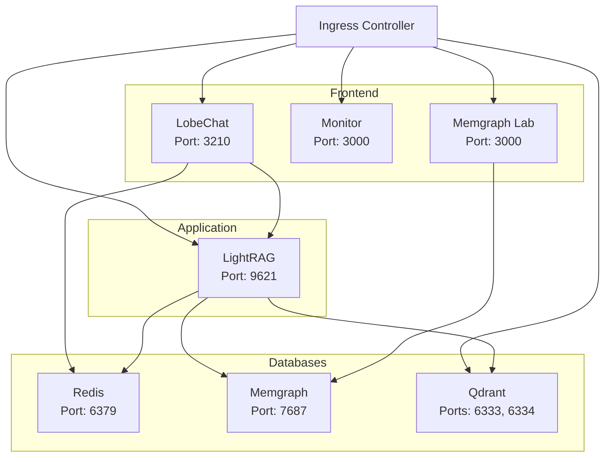

# LightRAG Kubernetes Deployment

This directory contains Kubernetes manifests for deploying the LightRAG stack in a Kubernetes cluster. The configuration mirrors the docker-compose setup but is optimized for Kubernetes orchestration.

## Table of Contents

- [Overview](#overview)
- [Prerequisites](#prerequisites)
- [Architecture](#architecture)
- [Quick Start](#quick-start)
- [Configuration](#configuration)
- [Deployment](#deployment)
- [Access Services](#access-services)
- [Scaling](#scaling)
- [Monitoring](#monitoring)
- [Troubleshooting](#troubleshooting)
- [Cleanup](#cleanup)

## Overview

The LightRAG Kubernetes deployment includes:

- **Redis** - Key-value storage and document status
- **Memgraph** - Graph database for knowledge graph
- **Memgraph Lab** - Web UI for graph visualization
- **Qdrant** - Vector database for embeddings
- **LightRAG** - Main RAG application
- **LobeChat** - Frontend chat interface
- **Monitor** - Optional monitoring UI (Isaiah)

## Prerequisites

### Required Tools

1. **Kubernetes Cluster** (one of):
   - Minikube (local development)
   - Kind (Kubernetes in Docker)
   - Docker Desktop with Kubernetes
   - Cloud provider (GKE, EKS, AKS)
   - On-premises cluster

2. **kubectl** - Kubernetes CLI
   ```bash
   # Install kubectl
   # macOS
   brew install kubectl

   # Linux
   curl -LO "https://dl.k8s.io/release/$(curl -L -s https://dl.k8s.io/release/stable.txt)/bin/linux/amd64/kubectl"
   sudo install -o root -g root -m 0755 kubectl /usr/local/bin/kubectl

   # Windows
   choco install kubernetes-cli
   ```

3. **Ingress Controller** (recommended: NGINX)
   ```bash
   # For most clusters
   kubectl apply -f https://raw.githubusercontent.com/kubernetes/ingress-nginx/controller-v1.10.0/deploy/static/provider/cloud/deploy.yaml

   # For minikube
   minikube addons enable ingress

   # For Docker Desktop
   kubectl apply -f https://raw.githubusercontent.com/kubernetes/ingress-nginx/controller-v1.10.0/deploy/static/provider/cloud/deploy.yaml
   ```

### Cluster Requirements

- **Kubernetes version**: 1.24+
- **CPU**: Minimum 12 cores (16 recommended)
- **Memory**: Minimum 24GB RAM
- **Storage**: 100GB+ available storage
- **Storage Class**: Default storage class configured for dynamic provisioning

### API Keys

You need valid API keys for:
- OpenAI API (or compatible LLM provider)
- OpenAI Embedding API (or compatible provider)

### Cloud Provider Deployment

**Deploying to a cloud provider?** See our comprehensive [Cloud Deployment Guide](CLOUD_DEPLOYMENT.md) for detailed instructions on:

- **Azure (AKS)** - Azure Kubernetes Service
- **AWS (EKS)** - Elastic Kubernetes Service
- **Google Cloud (GKE)** - Google Kubernetes Engine
- **DigitalOcean (DOKS)** - DigitalOcean Kubernetes
- **Civo** - Civo Kubernetes

The guide includes:
- Step-by-step cluster creation
- Storage and networking configuration
- DNS and SSL setup
- Cost estimates and comparisons
- Provider-specific optimizations

**Quick cost comparison:**
- Civo: ~$75/month (most affordable)
- DigitalOcean: ~$186/month (great value)
- Azure: ~$385/month (enterprise features)
- AWS: ~$437/month (most flexible)
- Google Cloud: ~$523/month (best for AI/ML)

## Architecture

### Service Dependencies



### Resource Allocation

| Component | CPU Request | CPU Limit | Memory Request | Memory Limit | Storage |
|-----------|-------------|-----------|----------------|--------------|---------|
| Redis | 250m | 500m | 512Mi | 1Gi | 5Gi |
| Memgraph | 2000m | 4000m | 4Gi | 8Gi | 10Gi + 2Gi logs |
| Qdrant | 1000m | 2000m | 2Gi | 4Gi | 20Gi + 10Gi snapshots |
| LightRAG | 1000m | 2000m | 2Gi | 4Gi | 20Gi + 10Gi + 5Gi |
| LobeChat | 250m | 500m | 512Mi | 1Gi | 5Gi |
| Memgraph Lab | 250m | 500m | 512Mi | 1Gi | - |
| Monitor | 250m | 500m | 512Mi | 1Gi | - |
| **Total** | **~5 CPU** | **~10 CPU** | **~10Gi** | **~20Gi** | **~87Gi** |

## Quick Start

### 1. Prepare Secrets

First, create your secrets file with base64-encoded values:

```bash
# Navigate to k8s directory
cd k8s

# Edit the secrets file with your actual values
# Replace placeholder values in 02-secrets.yaml

# Example: Encode your Redis password
echo -n "your-redis-password" | base64

# Example: Encode your OpenAI API key
echo -n "sk-your-openai-api-key" | base64
```

**IMPORTANT**: Update `02-secrets.yaml` with your actual base64-encoded values before deploying!

### 2. Deploy All Services

```bash
# Deploy in order (numbered files ensure proper ordering)
kubectl apply -f 00-namespace.yaml
kubectl apply -f 01-configmaps.yaml
kubectl apply -f 02-secrets.yaml
kubectl apply -f 03-storage.yaml
kubectl apply -f 04-redis.yaml
kubectl apply -f 05-memgraph.yaml
kubectl apply -f 06-qdrant.yaml
kubectl apply -f 07-lightrag.yaml
kubectl apply -f 08-lobechat.yaml
kubectl apply -f 09-monitor.yaml
kubectl apply -f 10-ingress.yaml

# Or deploy all at once
kubectl apply -f .
```

### 3. Verify Deployment

```bash
# Check namespace
kubectl get namespace lightrag

# Check all resources
kubectl get all -n lightrag

# Check pods status
kubectl get pods -n lightrag

# Check persistent volumes
kubectl get pvc -n lightrag

# Check ingress
kubectl get ingress -n lightrag
```

### 4. Configure DNS

Get your ingress IP address:

```bash
# For LoadBalancer type
kubectl get ingress -n lightrag -o jsonpath='{.items[0].status.loadBalancer.ingress[0].ip}'

# For minikube
minikube ip

# For Docker Desktop
# Use 127.0.0.1
```

Add to your `/etc/hosts` (or `C:\Windows\System32\drivers\etc\hosts` on Windows):

```text
<INGRESS_IP> dev.localhost
<INGRESS_IP> chat.dev.localhost
<INGRESS_IP> lobechat.dev.localhost
<INGRESS_IP> rag.dev.localhost
<INGRESS_IP> api.dev.localhost
<INGRESS_IP> graph.dev.localhost
<INGRESS_IP> vector.dev.localhost
<INGRESS_IP> monitor.dev.localhost
```

## Configuration

### Environment Variables

Configuration is managed through ConfigMaps and Secrets:

#### ConfigMaps (`01-configmaps.yaml`)

- `lightrag-config`: Core LightRAG configuration
- `lobechat-config`: LobeChat-specific settings

To update configuration:

```bash
# Edit the ConfigMap
kubectl edit configmap lightrag-config -n lightrag

# Or update from file
kubectl apply -f 01-configmaps.yaml

# Restart affected pods
kubectl rollout restart deployment/lightrag -n lightrag
```

#### Secrets (`02-secrets.yaml`)

**Never commit real secrets to git!** Use one of these approaches:

##### Option 1: Manual Secret Creation

```bash
# Create secrets from command line
kubectl create secret generic lightrag-secrets \
  --namespace=lightrag \
  --from-literal=REDIS_PASSWORD='your-redis-password' \
  --from-literal=LLM_BINDING_API_KEY='sk-your-llm-key' \
  --from-literal=EMBEDDING_BINDING_API_KEY='sk-your-embedding-key' \
  --from-literal=OPENAI_API_KEY='sk-your-openai-key' \
  --from-literal=LIGHTRAG_API_KEY='your-lightrag-key' \
  --from-literal=LOBECHAT_ACCESS_CODE='your-access-code'

kubectl create secret generic redis-secret \
  --namespace=lightrag \
  --from-literal=password='your-redis-password'
```

##### Option 2: From .env Files

```bash
# Create secrets from .env files (recommended for migration from docker-compose)
kubectl create secret generic lightrag-secrets \
  --namespace=lightrag \
  --from-env-file=../.env.secrets
```

##### Option 3: Sealed Secrets (Production)

For production, use [Sealed Secrets](https://github.com/bitnami-labs/sealed-secrets) or a secret management tool:

```bash
# Install sealed-secrets controller
kubectl apply -f https://github.com/bitnami-labs/sealed-secrets/releases/download/v0.24.0/controller.yaml

# Create sealed secret
kubeseal --format=yaml < 02-secrets.yaml > 02-secrets-sealed.yaml

# Commit sealed secret to git (safe)
git add 02-secrets-sealed.yaml
```

### Storage Configuration

#### Dynamic Provisioning (Default)

By default, PVCs use the cluster's default storage class:

```bash
# Check available storage classes
kubectl get storageclass

# Set a specific storage class in 03-storage.yaml
# Uncomment and set: storageClassName: your-storage-class
```

#### Static Provisioning

For local development or specific storage requirements:

```bash
# Create local PersistentVolumes
# Example for minikube
kubectl apply -f - <<EOF
apiVersion: v1
kind: PersistentVolume
metadata:
  name: lightrag-data-pv
spec:
  capacity:
    storage: 20Gi
  accessModes:
    - ReadWriteOnce
  hostPath:
    path: /data/lightrag
EOF
```

## Deployment

### Standard Deployment

```bash
# Deploy everything
kubectl apply -f k8s/

# Watch deployment progress
kubectl get pods -n lightrag -w

# Check deployment status
kubectl rollout status deployment/lightrag -n lightrag
kubectl rollout status deployment/lobechat -n lightrag
```

### Staged Deployment

For production or when troubleshooting:

```bash
# 1. Core infrastructure
kubectl apply -f k8s/00-namespace.yaml
kubectl apply -f k8s/01-configmaps.yaml
kubectl apply -f k8s/02-secrets.yaml
kubectl apply -f k8s/03-storage.yaml

# 2. Databases (wait for ready)
kubectl apply -f k8s/04-redis.yaml
kubectl wait --for=condition=ready pod -l app.kubernetes.io/name=redis -n lightrag --timeout=300s

kubectl apply -f k8s/05-memgraph.yaml
kubectl wait --for=condition=ready pod -l app.kubernetes.io/name=memgraph -n lightrag --timeout=300s

kubectl apply -f k8s/06-qdrant.yaml
kubectl wait --for=condition=ready pod -l app.kubernetes.io/name=qdrant -n lightrag --timeout=300s

# 3. Application
kubectl apply -f k8s/07-lightrag.yaml
kubectl wait --for=condition=ready pod -l app.kubernetes.io/name=lightrag -n lightrag --timeout=300s

# 4. Frontend
kubectl apply -f k8s/08-lobechat.yaml
kubectl apply -f k8s/09-monitor.yaml

# 5. Networking
kubectl apply -f k8s/10-ingress.yaml
```

### Verify Deployment

```bash
# Check all pods are running
kubectl get pods -n lightrag

# Expected output:
# NAME                            READY   STATUS    RESTARTS   AGE
# lightrag-xxxxxx-xxxxx          1/1     Running   0          2m
# lobechat-xxxxxx-xxxxx          1/1     Running   0          1m
# memgraph-0                      1/1     Running   0          3m
# memgraph-lab-xxxxxx-xxxxx      1/1     Running   0          3m
# monitor-xxxxxx-xxxxx           1/1     Running   0          1m
# qdrant-0                        1/1     Running   0          3m
# redis-0                         1/1     Running   0          4m

# Check service endpoints
kubectl get svc -n lightrag

# Check ingress
kubectl get ingress -n lightrag
```

## Access Services

### Service URLs

After deployment and DNS configuration:

| Service | URL | Description |
|---------|-----|-------------|
| Main | https://dev.localhost | Redirects to LobeChat |
| LobeChat | https://chat.dev.localhost | Main chat interface |
| LobeChat (alt) | https://lobechat.dev.localhost | Alternative URL |
| LightRAG API | https://rag.dev.localhost | RAG API endpoint |
| LightRAG API (alt) | https://api.dev.localhost | CORS-free API endpoint |
| Memgraph Lab | https://graph.dev.localhost | Graph visualization |
| Qdrant UI | https://vector.dev.localhost | Vector database UI |
| Monitor | https://monitor.dev.localhost | Monitoring dashboard |

### Port Forwarding (Alternative Access)

If you don't want to configure Ingress:

```bash
# LobeChat
kubectl port-forward -n lightrag svc/lobechat 3210:3210

# LightRAG
kubectl port-forward -n lightrag svc/lightrag 9621:9621

# Memgraph Lab
kubectl port-forward -n lightrag svc/memgraph-lab 3000:3000

# Qdrant
kubectl port-forward -n lightrag svc/qdrant 6333:6333

# Redis (for debugging)
kubectl port-forward -n lightrag svc/redis 6379:6379
```

Then access via:
- LobeChat: http://localhost:3210
- LightRAG: http://localhost:9621
- Memgraph Lab: http://localhost:3000
- Qdrant: http://localhost:6333

## Scaling

### Horizontal Scaling

```bash
# Scale LobeChat for more frontend capacity
kubectl scale deployment lobechat --replicas=3 -n lightrag

# Scale LightRAG (requires shared storage or database-backed state)
kubectl scale deployment lightrag --replicas=2 -n lightrag

# Note: Databases (Redis, Memgraph, Qdrant) are StatefulSets
# Scaling them requires additional configuration
```

### Vertical Scaling

Edit resource limits in deployment files:

```bash
# Edit deployment
kubectl edit deployment lightrag -n lightrag

# Or update the YAML and apply
kubectl apply -f k8s/07-lightrag.yaml

# Verify changes
kubectl rollout status deployment/lightrag -n lightrag
```

### Autoscaling (HPA)

```bash
# Create Horizontal Pod Autoscaler for LobeChat
kubectl autoscale deployment lobechat \
  --namespace=lightrag \
  --min=1 \
  --max=5 \
  --cpu-percent=80

# Create HPA for LightRAG
kubectl autoscale deployment lightrag \
  --namespace=lightrag \
  --min=1 \
  --max=3 \
  --cpu-percent=70

# Check HPA status
kubectl get hpa -n lightrag
```

## Monitoring

### Check Pod Logs

```bash
# LightRAG logs
kubectl logs -n lightrag deployment/lightrag --tail=100 -f

# LobeChat logs
kubectl logs -n lightrag deployment/lobechat --tail=100 -f

# Redis logs
kubectl logs -n lightrag statefulset/redis --tail=100 -f

# Memgraph logs
kubectl logs -n lightrag statefulset/memgraph --tail=100 -f

# All pods logs (requires stern or kubetail)
stern -n lightrag .
```

### Resource Usage

```bash
# Pod resource usage
kubectl top pods -n lightrag

# Node resource usage
kubectl top nodes

# Detailed pod metrics
kubectl describe pod <pod-name> -n lightrag
```

### Health Checks

```bash
# Check pod health
kubectl get pods -n lightrag

# Describe pod for events
kubectl describe pod <pod-name> -n lightrag

# Check liveness/readiness probes
kubectl get events -n lightrag --sort-by='.lastTimestamp'
```

### Prometheus & Grafana (Optional)

Install Prometheus stack for comprehensive monitoring:

```bash
# Add Prometheus Helm repo
helm repo add prometheus-community https://prometheus-community.github.io/helm-charts
helm repo update

# Install Prometheus + Grafana
helm install prometheus prometheus-community/kube-prometheus-stack \
  --namespace monitoring \
  --create-namespace

# Access Grafana
kubectl port-forward -n monitoring svc/prometheus-grafana 3000:80
# Default credentials: admin / prom-operator
```

## Troubleshooting

### Pods Not Starting

```bash
# Check pod status
kubectl get pods -n lightrag

# Describe pod to see events
kubectl describe pod <pod-name> -n lightrag

# Check logs
kubectl logs <pod-name> -n lightrag

# Common issues:
# 1. ImagePullBackOff - Check image name and registry access
# 2. CrashLoopBackOff - Check logs for application errors
# 3. Pending - Check PVC status and node resources
```

### Storage Issues

```bash
# Check PVC status
kubectl get pvc -n lightrag

# Describe PVC for events
kubectl describe pvc <pvc-name> -n lightrag

# Check PV
kubectl get pv

# Common issues:
# 1. Pending PVC - No available PV or storage class
# 2. Lost PVC - Node or storage backend issue
```

### Service Connectivity

```bash
# Test internal DNS
kubectl run -it --rm debug --image=busybox --restart=Never -n lightrag -- nslookup redis

# Test service connectivity
kubectl run -it --rm debug --image=curlimages/curl --restart=Never -n lightrag -- \
  curl -v http://lightrag:9621/health

# Check service endpoints
kubectl get endpoints -n lightrag
```

### Ingress Issues

```bash
# Check ingress status
kubectl get ingress -n lightrag

# Describe ingress
kubectl describe ingress lightrag-ingress -n lightrag

# Check ingress controller logs
kubectl logs -n ingress-nginx deployment/ingress-nginx-controller

# Test without ingress (port-forward)
kubectl port-forward -n lightrag svc/lobechat 3210:3210
```

### Secret Issues

```bash
# Verify secrets exist
kubectl get secrets -n lightrag

# Check secret contents (base64 encoded)
kubectl get secret lightrag-secrets -n lightrag -o yaml

# Decode secret value (for debugging)
kubectl get secret lightrag-secrets -n lightrag -o jsonpath='{.data.REDIS_PASSWORD}' | base64 -d
```

### Database Connection Issues

```bash
# Test Redis connection
kubectl run -it --rm redis-test --image=redis:8-alpine --restart=Never -n lightrag -- \
  redis-cli -h redis -a <password> ping

# Test Memgraph connection
kubectl run -it --rm memgraph-test --image=memgraph/memgraph:latest --restart=Never -n lightrag -- \
  bash -c "timeout 5s bash -c '</dev/tcp/memgraph/7687' && echo 'Connected'"

# Test Qdrant connection
kubectl run -it --rm qdrant-test --image=curlimages/curl --restart=Never -n lightrag -- \
  curl -v http://qdrant:6333
```

### Performance Issues

```bash
# Check resource usage
kubectl top pods -n lightrag
kubectl top nodes

# Check resource limits
kubectl describe deployment lightrag -n lightrag | grep -A 5 "Limits"

# Increase resources if needed (edit deployment)
kubectl edit deployment lightrag -n lightrag
```

### Logs Aggregation

```bash
# Get all container logs from a pod
kubectl logs <pod-name> -n lightrag --all-containers=true

# Previous container logs (if crashed)
kubectl logs <pod-name> -n lightrag --previous

# Stream logs from multiple pods
kubectl logs -n lightrag -l app.kubernetes.io/name=lightrag --tail=100 -f
```

## Cleanup

### Remove All Resources

```bash
# Delete everything in namespace
kubectl delete namespace lightrag

# Or delete individual components
kubectl delete -f k8s/
```

### Remove Persistent Data

```bash
# CAUTION: This will delete all data!

# Delete PVCs (this deletes data)
kubectl delete pvc --all -n lightrag

# Delete PVs if using static provisioning
kubectl delete pv -l app.kubernetes.io/part-of=lightrag-stack

# For local development (minikube/docker-desktop)
# Delete local directories if using hostPath
sudo rm -rf /data/lightrag/*
```

### Cleanup Ingress

```bash
# Delete ingress
kubectl delete ingress lightrag-ingress -n lightrag

# Uninstall ingress controller (if dedicated)
kubectl delete -f https://raw.githubusercontent.com/kubernetes/ingress-nginx/controller-v1.10.0/deploy/static/provider/cloud/deploy.yaml

# For minikube
minikube addons disable ingress
```

## Production Considerations

### Security

1. **Use Secrets Management**
   - Use external secret management (Vault, AWS Secrets Manager, etc.)
   - Don't commit secrets to git
   - Rotate secrets regularly

2. **Network Policies**
   ```bash
   # Apply network policies to restrict traffic
   kubectl apply -f network-policies.yaml
   ```

3. **RBAC**
   - Create service accounts with minimal permissions
   - Use Pod Security Standards

4. **TLS/SSL**
   - Use cert-manager for automatic certificate management
   - Enable HTTPS for all ingress endpoints

### High Availability

1. **Multiple Replicas**
   - Run multiple replicas of stateless services
   - Use anti-affinity for pod distribution

2. **Database HA**
   - Configure Redis Sentinel or Cluster
   - Use Memgraph Enterprise for HA
   - Configure Qdrant cluster

3. **Backup Strategy**
   - Regular PVC snapshots
   - Database-specific backups
   - Test restore procedures

### Resource Management

1. **Resource Quotas**
   ```bash
   kubectl create quota lightrag-quota \
     --hard=cpu=20,memory=40Gi,persistentvolumeclaims=20 \
     --namespace=lightrag
   ```

2. **Limit Ranges**
   ```bash
   # Set default limits for containers
   kubectl apply -f limit-ranges.yaml
   ```

3. **Cost Optimization**
   - Use node selectors for cost-effective nodes
   - Implement cluster autoscaling
   - Monitor and optimize resource requests

## Migration from Docker Compose

### Data Migration

1. **Export data from Docker volumes**:
   ```bash
   # Redis
   docker exec -it kv redis-cli --rdb /data/dump.rdb
   docker cp kv:/data/dump.rdb ./redis-backup.rdb

   # Memgraph
   docker exec -it graph bash -c "echo 'DUMP DATABASE;' | mgconsole"

   # Qdrant
   docker exec -it vectors curl -X POST 'http://localhost:6333/snapshots'
   ```

2. **Import to Kubernetes**:
   ```bash
   # Copy data to PVC
   kubectl cp redis-backup.rdb lightrag/redis-0:/data/dump.rdb

   # Restart pods
   kubectl rollout restart statefulset/redis -n lightrag
   ```

### Configuration Migration

```bash
# Convert .env files to ConfigMap
kubectl create configmap lightrag-config \
  --from-env-file=../.env \
  --from-env-file=../.env.lightrag \
  --namespace=lightrag \
  --dry-run=client -o yaml > 01-configmaps-generated.yaml

# Convert secrets
kubectl create secret generic lightrag-secrets \
  --from-env-file=../.env.secrets \
  --namespace=lightrag \
  --dry-run=client -o yaml > 02-secrets-generated.yaml
```

## Support

For issues and questions:
- GitHub Issues: [LightRAG Repository](https://github.com/HKUDS/LightRAG)
- Documentation: Check main [README.md](../README.md)
- Kubernetes Docs: https://kubernetes.io/docs/

## License

Same as the main LightRAG project.
