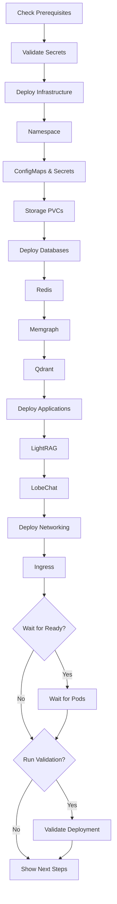

# LightRAG Kubernetes Deployment Scripts

This directory contains helper scripts for deploying and managing the LightRAG Kubernetes deployment.

## Scripts Overview

### `deploy.sh` - Automated Deployment Script

Deploys the complete LightRAG stack with validation and health checks.

**Usage:**
```bash
./deploy.sh [options]
```

**Options:**
- `-n, --namespace <name>` - Namespace to deploy to (default: lightrag)
- `-s, --skip-validation` - Skip post-deployment validation
- `-w, --wait` - Wait for all pods to be ready before exiting
- `-h, --help` - Show help message

**Examples:**
```bash
# Deploy to default namespace
./deploy.sh

# Deploy to production namespace and wait for all pods
./deploy.sh --namespace production --wait

# Quick deployment without validation
./deploy.sh --skip-validation
```

**Features:**
- Validates prerequisites (kubectl, cluster connectivity)
- Checks secrets configuration for placeholder values
- Deploys resources in the correct order
- Optionally waits for all pods to be ready
- Runs post-deployment validation
- Provides next steps and access instructions

---

### `validate.sh` - Deployment Validation Script

Validates that all components are healthy and running correctly.

**Usage:**
```bash
./validate.sh [namespace]
```

**Default namespace:** `lightrag`

**Examples:**
```bash
# Validate default namespace
./validate.sh

# Validate specific namespace
./validate.sh production
```

**Validation Checks:**
1. ✓ Namespace exists
2. ✓ PersistentVolumeClaims are bound
3. ✓ Database pods are ready (Redis, Memgraph, Qdrant)
4. ✓ Application pods are ready (LightRAG, LobeChat)
5. ✓ Services have endpoints
6. ✓ HTTP health endpoints respond correctly
7. ✓ Ingress resources are configured

**Exit Codes:**
- `0` - All checks passed
- `1` - One or more checks failed

**Environment Variables:**
- `TIMEOUT` - Maximum wait time in seconds (default: 600)

---

## Quick Start

### First Time Deployment

1. **Update secrets** (required):
   ```bash
   cd ../
   # Edit 02-secrets.yaml with your base64-encoded secrets
   echo -n "your-redis-password" | base64
   echo -n "sk-your-openai-key" | base64
   ```

2. **Deploy the stack**:
   ```bash
   cd scripts/
   ./deploy.sh --wait
   ```

3. **Validation runs automatically** and will show:
   - Pod readiness status
   - Service health checks
   - HTTP endpoint tests
   - Ingress configuration
   - Access instructions

### Update Existing Deployment

```bash
# Update and wait for rollout
./deploy.sh --wait

# Quick update without validation
./deploy.sh --skip-validation
```

### Manual Validation

After making changes or troubleshooting:

```bash
./validate.sh
```

---

## Deployment Flow

The `deploy.sh` script follows this sequence:



---

## Troubleshooting

### Deployment Fails

**Check pod status:**
```bash
kubectl get pods -n lightrag
kubectl describe pod <pod-name> -n lightrag
kubectl logs <pod-name> -n lightrag
```

**Check validation output:**
```bash
./validate.sh lightrag
```

### Validation Fails

The validation script will show which component failed:

**Example output:**
```
[ERROR] LightRAG pods failed to become ready
[ERROR] HTTP endpoint responded with 503 (expected 200)
```

**Common issues:**

1. **PVC not bound**: Check storage class
   ```bash
   kubectl get pvc -n lightrag
   kubectl get storageclass
   ```

2. **Pod not ready**: Check logs
   ```bash
   kubectl logs -n lightrag -l app.kubernetes.io/name=lightrag --tail=100
   ```

3. **HTTP endpoint fails**: Check service and pod
   ```bash
   kubectl get svc -n lightrag
   kubectl get endpoints -n lightrag
   ```

### Secrets Not Configured

If you see:
```
[WARNING] Detected placeholder values in secrets file
```

**Action:** Update `k8s/02-secrets.yaml` with real values:
```bash
# Encode your secrets
echo -n "your-redis-password" | base64
echo -n "sk-your-openai-key" | base64

# Update 02-secrets.yaml with encoded values
```

---

## Advanced Usage

### Using Kustomize

If `kustomization.yaml` exists, the deployment script will automatically use Kustomize:

```bash
# Deploys using: kubectl apply -k .
./deploy.sh
```

### Custom Timeout

Set a custom timeout for validation:

```bash
TIMEOUT=1200 ./validate.sh
```

### CI/CD Integration

Use in CI/CD pipelines:

```bash
#!/bin/bash
set -euo pipefail

# Deploy
./deploy.sh --namespace staging --wait

# Validate
if ! ./validate.sh staging; then
    echo "Deployment validation failed"
    exit 1
fi

# Run integration tests
./run-integration-tests.sh
```

### Monitoring Deployment Progress

```bash
# Terminal 1: Deploy
./deploy.sh --wait

# Terminal 2: Watch pods
watch kubectl get pods -n lightrag

# Terminal 3: Stream logs
kubectl logs -n lightrag -l app.kubernetes.io/name=lightrag --tail=50 -f
```

---

## Script Dependencies

### Required Tools

- `kubectl` - Kubernetes CLI
- `bash` - Shell (v4.0+)
- `jq` - JSON processor (for validation script)

### Optional Tools

- `stern` - Multi-pod log streaming
- `kubetail` - Alternative log tailing

### Installation

**macOS:**
```bash
brew install kubectl jq stern
```

**Linux:**
```bash
# kubectl
curl -LO "https://dl.k8s.io/release/$(curl -L -s https://dl.k8s.io/release/stable.txt)/bin/linux/amd64/kubectl"
sudo install kubectl /usr/local/bin/

# jq
sudo apt-get install jq  # Debian/Ubuntu
sudo yum install jq      # RHEL/CentOS
```

---

## See Also

- [Main K8s README](../README.md) - Complete Kubernetes deployment guide
- [Cloud Deployment Guide](../CLOUD_DEPLOYMENT.md) - Cloud provider specific instructions
- [Cluster Maintenance](../CLUSTER_MAINTENANCE.md) - Ongoing maintenance procedures
- [Cost Monitoring](../COST_MONITORING.md) - Cost tracking with Kubecost

---

## Contributing

Improvements to these scripts are welcome! Please ensure:

1. Scripts remain POSIX-compliant where possible
2. Error handling is comprehensive
3. Output is colored and user-friendly
4. Documentation is updated

## License

Same as the main LightRAG project.
